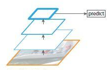
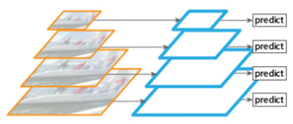
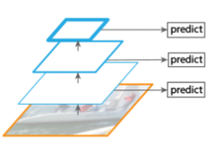
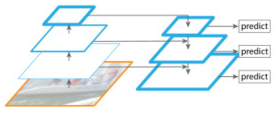
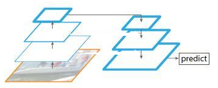
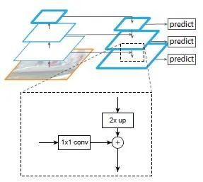

# 目标检测之FPN网络

特征图金字塔网络FPN（Feature Pyramid Networks）是2017年提出的一种网络，FPN主要解决的是物体检测中的多尺度问题，通过简单的网络连接改变，在基本不增加原有模型计算量的情况下，大幅度提升了小物体检测的性能。

低层的特征语义信息比较少，但是目标位置准确；高层的特征语义信息比较丰富，但是目标位置比较粗略。另外虽然也有些算法采用多尺度特征融合的方式，但是一般是采用融合后的特征做预测，而本文FPN不一样的地方在于预测是在不同特征层独立进行的。 

## 一、各种网络结构对比

**1、通常的CNN网络结构如下图所示**

上图网络是自底向上卷积，然后使用最后一层特征图进行预测，像SPP-Net，Fast R-CNN，Faster R-CNN就是采用这种方式，即仅采用网络最后一层的特征。

以VGG16为例子，假如feat_stride=16，表示若原图大小是1000*600，经过网络后最深一层的特征图大小是60*40，可理解为特征图上一像素点映射原图中一个16*16的区域；那原图中有一个小于16*16大小的小物体，是不是就会被忽略掉，检测不到了呢？

所以上图中的网络的缺点就是会造成检测小物体的性能急剧下降。

**2、图片金字塔生成特征金字塔**

鉴于上面的单层检测会丢失细节特征；就会想到利用图像的各个尺度进行训练和测试，比如下图所展示，将图像做成不同的scale，然后不同scale的图像生成对应的不同scale的特征

将图片缩放成多个比例，每个比例单独提取特征图进行预测，这样，可以得到比较理想的结果，但是比较耗时，不太适合运用到实际当中。有些算法仅会在测试时候采用图像金字塔。

**3、多尺度特征融合的方式**

像SSD（Single Shot Detector）就是采用这种多尺度特征融合的方式，没有上采样过程，即从网络不同层抽取不同尺度的特征做预测，这种方式不会增加额外的计算量。作者认为SSD算法中没有用到足够低层的特征（在SSD中，最低层的特征是VGG网络的conv4_3），而在作者看来足够低层的特征对于检测小物体是很有帮助的。

**4、FPN（Feature Pyramid Networks）**

这是本文要讲的网络，FPN主要解决的是物体检测中的多尺度问题，通过简单的网络连接改变，在基本不增加原有模型计算量的情况下，大幅度提升了小物体检测的性能。通过高层特征进行上采样和低层特征进行自顶向下的连接，而且每一层都会进行预测。后面再详细介绍，下面先来看看另外两种

**5、top-down pyramid w/o lateral**

上图该网络有自顶向下的过程，但是没有横向连接，即向下过程没有融合原来的特征。实验发现这样效果比图1的网络效果更差。

**6、only finest nevel**

上图带有skip connection的网络结构在预测的时候是在finest level（自顶向下的最后一层）进行的，简单讲就是经过多次上采样并融合特征到最后一步，拿最后一步生成的特征做预测，跟FPN的区别是它仅在最后一层预测。

##  二、FPN详解

作者的主网络采用了ResNet。

算法大致结构如下：一个自底向上的线路，一个自顶向下的线路，横向连接（lateral connection）。图中放大的区域就是横向连接，这里1*1的卷积核的主要作用是减少卷积核的个数，也就是减少了feature map的个数，并不改变feature map的尺寸大小。

**① 自底向上：**

自底向上的过程就是神经网络普通的前向传播过程，特征图经过卷积核计算，通常会越变越小。

具体而言，对于ResNets，我们使用每个阶段的最后一个residual block输出的特征激活输出。对于conv2，conv3，conv4和conv5输出，我们将这些最后residual block的输出表示为{C2，C3，C4，C5}，并且它们相对于输入图像具有{4, 8, 16, 32} 的步长。由于其庞大的内存占用，我们不会将conv1纳入金字塔中。

**② 自上而下：**

自上而下的过程是把更抽象、语义更强的高层特征图进行上采样（upsampling），而横向连接则是将上采样的结果和自底向上生成的相同大小的feature map进行融合（merge）。横向连接的两层特征在空间尺寸相同，这样做可以利用底层定位细节信息。将低分辨率的特征图做2倍上采样（为了简单起见，使用最近邻上采样）。然后通过按元素相加，将上采样映射与相应的自底而上映射合并。这个过程是迭代的，直到生成最终的分辨率图。 

为了开始迭代，我们只需在C5上附加一个1×1卷积层来生成低分辨率图P5。最后，我们在每个合并的图上附加一个3×3卷积来生成最终的特征映射，这是为了减少上采样的混叠效应。这个最终的特征映射集称为{P2，P3，P4，P5}，分别对应于{C2，C3，C4，C5}，它们具有相同的尺寸。 

由于金字塔的所有层次都像传统的特征化图像金字塔一样使用共享分类器/回归器，因此我们在所有特征图中固定特征维度（通道数，记为d）。我们在本文中设置d = 256，因此所有额外的卷积层都有256个通道的输出。

**③ 横向连接：**

采用1×1的卷积核进行连接（减少特征图数量）。

 **三、FPN加入到各种网络的实验效果表**

作者一方面将FPN放在RPN网络中用于生成proposal，原来的RPN网络是以主网络的某个卷积层输出的feature map作为输入，简单讲就是只用这一个尺度的feature map。但是现在要将FPN嵌在RPN网络中，生成不同尺度特征并融合作为RPN网络的输入。在每一个scale层，都定义了不同大小的anchor，对于P2，P3，P4，P5，P6这些层，定义anchor的大小为32^2,64^2,128^2,256^2，512^2，另外每个scale层都有3个长宽对比度：1:2，1:1，2:1。所以整个特征金字塔有15种anchor。

正负样本的界定和Faster RCNN差不多：如果某个anchor和一个给定的ground truth有最高的IOU或者和任意一个Ground truth的IOU都大于0.7，则是正样本。如果一个anchor和任意一个ground truth的IOU都小于0.3，则为负样本。

加入FPN的RPN网络的有效性如下表Table1。网络这些结果都是基于ResNet-50的。评价标准采用AR（Average Recall），AR右上角的100或1K表示每张图像有100或1000个anchor，AR的右下角s，m，l表示COCO数据集中object的大小分别是小，中，大。feature列的大括号{}表示每层独立预测。

Table1

从（a）（b）（c）的对比可以看出FRN的作用确实很明显。另外（a）和（b）的对比可以看出高层特征并非比低一层的特征有效。 

（d）表示只有横向连接，而没有自顶向下的过程，也就是仅仅对自底向上的每一层结果做一个1*1的横向连接和3*3的卷积得到最终的结果，从feature列可以看出预测还是分层独立的，如上面图3的结构。作者推测（d）的结果并不好的原因在于在自底向上的不同层之间的semantic gaps比较大。 

（e）表示有自顶向下的过程，但是没有横向连接，即向下过程没有融合原来的特征，如上面图5的结构。这样效果也不好的原因在于目标的location特征在经过多次降采样和上采样过程后变得更加不准确。 

（f）采用finest level层做预测（如上图6的结构），即经过多次特征上采样和融合到最后一步生成的特征用于预测，主要是证明金字塔分层独立预测的表达能力。显然finest level的效果不如FPN好，原因在于PRN网络是一个窗口大小固定的滑动窗口检测器，因此在金字塔的不同层滑动可以增加其对尺度变化的鲁棒性。另外（f）有更多的anchor，说明增加anchor的数量并不能有效提高准确率。

另一方面将FPN用于Fast R-CNN的检测部分。除了（a）以外，分类层和卷积层之前添加了2个1024维的全连接层。 

实验结果如下表Table2，这里是测试Fast R-CNN的检测效果，所以proposal是固定的（采用Table1（c）的做法）。与Table1的比较类似，（a）（b）（c）的对比证明在基于区域的目标卷积问题中，特征金字塔比单尺度特征更有效。（c）（f）的差距很小，作者认为原因是ROI pooling对于region的尺度并不敏感。因此并不能一概认为（f）这种特征融合的方式不好，博主个人认为要针对具体问题来看待，像上面在RPN网络中，可能（f）这种方式不大好，但是在Fast RCNN中就没那么明显。

Table2

同理，将FPN用于Faster RCNN的实验结果如下表Table3。

Table3

下表Table4是和近几年在COCO比赛上排名靠前的算法的对比。注意到本文算法在小物体检测上的提升是比较明显的。

Table4

 

  ***\*四、总结\****

# 

作者提出的FPN（Feature Pyramid Network）算法同时利用低层特征高分辨率和高层特征的高语义信息，通过融合这些不同层的特征达到预测的效果。并且预测是在每个融合后的特征层上单独进行的，效果甚佳。