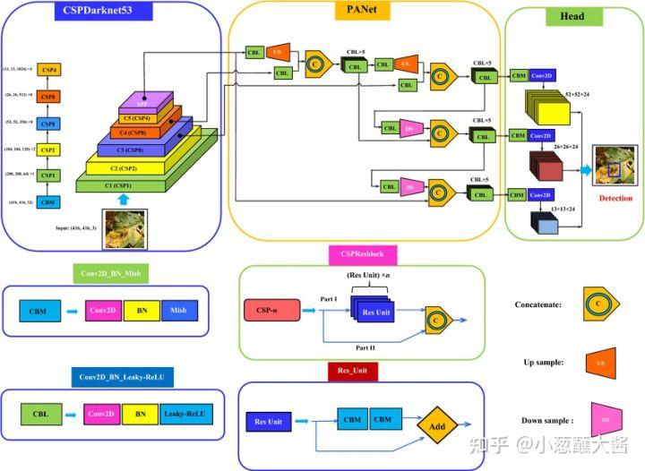

# 目标检测网络中的backbone, neck, head

基于的现在目标检测算法中有三个组件：Backbone、Neck和Head。

**Backbone,** 译作骨干网络，主要指用于特征提取的，已在大型数据集(例如ImageNet|COCO等)上完成预训练，拥有预训练参数的卷积神经网络，例如：ResNet-50、Darknet53等;
**Head**，译作检测头，主要用于预测目标的种类和位置(bounding boxes)，在Backone和Head之间，会添加一些用于收集不同阶段中特征图的网络层，通常称为**Neck**。

简而言之，基于深度学习的目标检测模型的结构是这样的：输入->主干->脖子->头->输出。

主干网络提取特征，脖子提取一些更复杂的特征，然后头部计算预测输出。
具体可看下面这幅图：

**input**: Image, patches, image pyramid,... ...

**Backbone**: VGG-16, ResNet-50, ResNeXt-101, Darknet53, 轻量级backbone(MobileNet, ShuffleNet, EfficientNet, ... ...)

**Neck**:
- Additional blocks: SPP, ASPP, RFB, SAM
- Path-aggregation blocks: FPN(Feature Pyramid Network), PANet(Path Aggregation Network), NAS-FPN, Fully-connected FPN, BiFPN, ASFF, SFAM

**Head:**
- dense prediction: RPN, YOLO, SSD(Single Shot MultiBox Detector), RetinaNet, FCOS(**F**ully **C**onvolutional **O**ne-**S**tage object detection),... ...
- Sparse prediction: Faster R-CNN, R-FCN, Mask R-CNN (anchor based)

## 分为三部分的原因

一、Backbone

通常，为了实现从图像中检测目标的位置和类别，我们会先从图像中提取出些必要的特征信息，比如HOG特征，然后利用这些特征去实现定位和分类。而在在深度学习这一块，backbone部分的网络就是负责从图像中提取特征，当然，这里提出的是什么样的特征，我们是无从得知的，毕竟深度学习的“黑盒子”特性至今还无法真正将其面纱揭开。

那么，如何去设计一个backbone去提取图像中的特征呢？

从某种意义上来说，如何设计好的backbone，更好地从图像中提取信息，是至关重要的，特征提取不好，自然会影响到后续的定位检测。在目标检测任务之前，深度学习技术在图像分类领域中发挥了重大的作用，起到了非常好的效果，尤其是在ResNet系列的工作问世后，图像分类任务几乎达到了一个顶峰。虽然后续这个领域还在陆陆续续地出现些新工作，但大多数都只是换汤不换药，涨涨点罢了。

深度学习技术之所以能够这么出色地完成图像分类任务，基本上体现出了其在图像特征提取这一块的出色表现。另外，考虑到目标检测任务中，也需要对图像中的物体进行类别的识别，因此，一个很直接的想法就是将图像分类的网络直接拿来做目标检测的任务。但目标检测除了需要分类，更重要的一点是在于定位，而这一点恰恰是做分类任务的网络所不具备的。

随着迁移学习概念的兴起和普及，通过在检测任务中的数据集上对分类网络进行微调似乎是一个很不错的想法，所谓的“ImageNet pretrained model”概念就诞生了。简单地来说，就是目标检测和图像分类这两个任务具有一定的相似性，因为可以将分类的网络，比如VGG、ResNet等，用来做特征提取器。这一部分，我们就称其为backbone。

所谓的backbone，直接翻译过来就是“骨干网络”，很明显，这个单词的含义就表明了它并不是整体的网络。既然两个任务具有相似性，再加之迁移学习思想的普及，为什么还会要用这么个单词来描述它呢？事实上，尽管目标检测和图像分类两个任务具有相似性，但不完全是等价的，目标检测的目标是实现对物体的定位和分类，而图像分类仅仅是对图像中的物体进行分类，而不会去定位。于是，就在“定位”这一点上，完全将分类网络搬过来使用显然是不恰当的。

从优化目标上来看，分类任务只做分类，而目标检测还需要做定位，因此，任务驱动不同，目标不同，因此，完全有理由相信二者的优化空间有很大的差异。所以，仅仅是微调网络是无法完成目标检测任务的，当然，这一点，我们会在后续的实践来验证的。

二、Detection head

解决的办法相当简单，既然仅仅靠分类网络是不行的，那么我们就在后面加一些网络层，让这些额外加进来的网络层去弥补分类网络无法定位的先天缺陷。于是，这条脉络就非常清晰了：分类网络迁移过来，用作特征提取器（通过在目标检测数据集上进行微调，并且与后续的网络的共同训练，使得它提取出来的特征更适合目标检测任务），后续的网络负责从这些特征中，检测目标的位置和类别。那么，我们就将分类网络所在的环节称之为“Backbone”，后续连接的网络层称之为“Detection head”。

随着技术的发展，除了backbone和head这两部分，更多的新奇的技术和模块被提了出来，最著名的，莫过于FPN了——《Feature Pyramid NetworksforObject Detection》提出的FPN结构，在不同的尺度（实际上就是不同大小的feature map）上去提取不同尺度的信息，并进行融合，充分利用好backbone提取的所有的特征信息，从而让网络能够更好地检测物体。有了FPN，backbone提取出的信息可以被利用的更加充分，使得detector能够很好地应对多尺度情况——图像中，目标的大小不一，大的、中等的、小的，都有，尤其是小物体，几乎成为了目标检测这一块的单独研究点。

三、Neck

除了FPN这种新颖的结构，还有诸如ASFF、RFB、SPP等好用的模块，都可以接在backbone后面，而这一部分，我们称之为“neck”，有些文章中直接把它翻译成“瓶颈”或“脖子”，neck这部分的作用就是更好地融合/提取backbone所给出的feature，从而提高网络的性能。

四、detector=backbone+neck+head

neck:提出一个好的结构或模块，更好适应feature

head:分类+定位

backbone:提取基础特征网络

> 补充backbone：尽管现在学术界已经知道了不用那些在ImageNet上预训练的模型作为backbone，而是自己搭建backbone网络或者使用分类网络，但不会加载预训练模型，也能够达到同样的效果，但是这样的代价就是需要花更多的实践来训练，如何对数据进行预处理也是要注意的，换句话说，给调参带来了更多的压力。关于这一点，感兴趣的读者可以阅读Kaming He的《Rethinking ImageNet Pre-training》。即便如此，大家还是会优先使用预训练模型，这么做，仅仅是减少我们的调参压力和训练时间所耗费的成本。

## 以YOLO v4为例

以YOLO v4为例，包括
• Backbone: CSPDarknet53
• Neck: SPP, PAN
• Head: YOLOv3

**Backbone:** CSPDarknet53，其主要是由五层残差网络resblock_body组成，其输入的图像像素是608*608，其中resblock_body有专门的卷积操作来降低分辨率，每一层的resblock_body将像素逐渐降低一倍，其主要功能是提取图像数据的特征信息。

**Neck**: 主要是由SPP（左下部分Conv×3到Concat+Conv×3）和PANet组成。SPP主要功能是增加感受野作用，PANet主要功能是将提取的特征信息转换为坐标、类别等信息，其主要是由上采样和下采样组成。

**Head**: 继续沿袭yolov3的检测头，其三个检测头主要功能是：得到输出之后，与真实数据标注相比较，计算出损失函数（其损失函数主要是由三部分组成：①定位损失②置信度损失③分类损失），然后根据需要对数据格式进行reshape，同时对原始格点坐标做相应的激活。

## 参考

1. [目标检测 Backbone、Neck、Detection head](https://blog.csdn.net/qq_19707521/article/details/109379072)
2. [目标检测网络中的backbone, neck, head](https://zhuanlan.zhihu.com/p/526036013)
