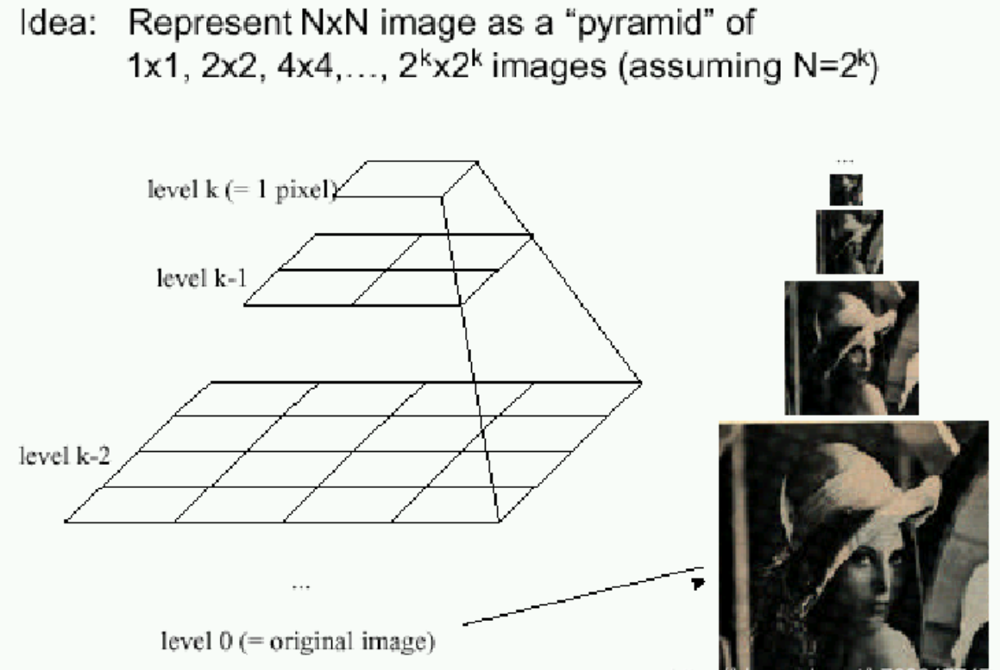
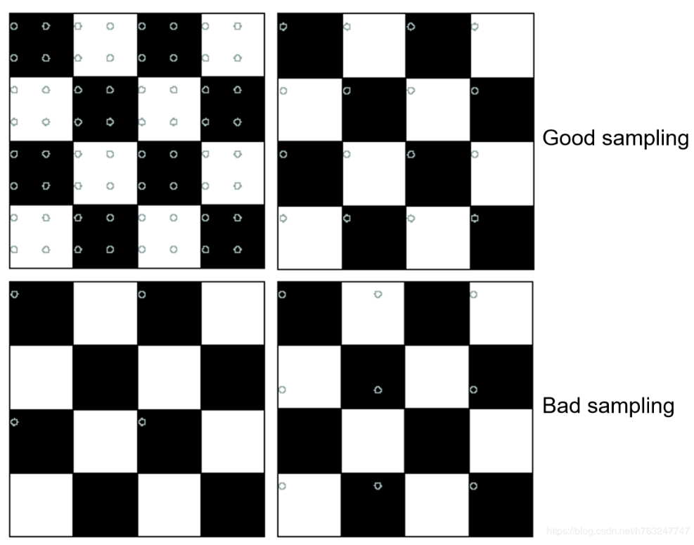
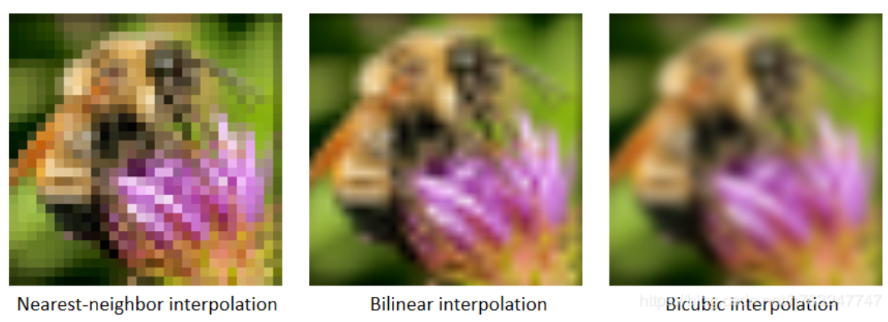
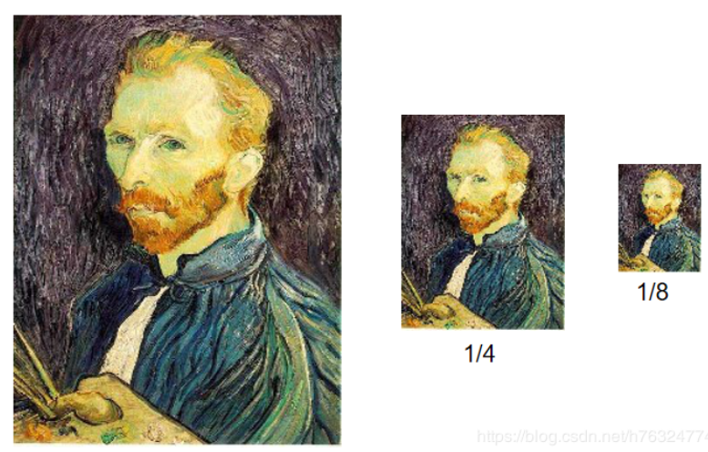

# 图像重采样（上下采样）

  **图像重采样包含两种情形，一种是下采样（downsampling），把图像变小；另一种是上采样（upsampling)，把图像变大。**

下采样：高斯金字塔顶端
 
       
上采样：例图
 

**（注：高斯金字塔实际上是图像的多尺度表示法。模仿人眼在近处看到的图像细致，对应金字塔底层；在远处看到图像较为模糊，但可以看到整个轮廓，对应金字塔顶层。）**

**缩小图像**（或称为下采样（subsampled）或降采样（downsampled））的主要目的有两个：1、使得图像符合显示区域的大小；2、生成对应图像的缩略图。

根据Nyquist采样定律，采样频率大于等于2倍的图像的最大频率。

对于高清图片，如果直接采样，采样频率很高。如果先对图像进行模糊化处理（高斯滤波），就可以降低采样频率了，最后进行次级采样（sub-sampling），就可以得到小一倍的图片了。**总结：下采样=高斯滤波+次级采样。**

**放大图像**（或称为上采样（upsampling）或图像插值（interpolating））的主要目的是放大原图像，从而可以显示在更高分辨率的显示设备上。对图像的缩放操作并不能带来更多关于该图像的信息, 因此图像的质量将不可避免地受到影响。然而，确实有一些缩放方法能够增加图像的信息，从而使得缩放后的图像质量超过原图质量的。

**下采样原理**：对于一幅图像I尺寸为M*N，对其进行s倍下采样，即得到(M/s)*(N/s)尺寸的得分辨率图像，当然s应该是M和N的公约数才行，如果考虑的是矩阵形式的图像，就是把原始图像s*s窗口内的图像变成一个像素，这个像素点的值就是窗口内所有像素的均值：

**上采样原理**：图像放大几乎都是采用内插值方法，即在原有图像像素的基础上在像素点之间采用合适的插值算法插入新的元素。

  无论缩放图像（下采样）还是放大图像（上采样），采样方式有很多种。如最近邻插值，双线性插值，均值插值，中值插值等方法。在AlexNet中就使用了较合适的插值方法。各种插值方法都有各自的优缺点。

# 采样的三种方法优劣比较

ENVI中重采样的三种方法优劣比较:

​    重采样：由于输出图像的像元点在输入图像中的行列号不是或不全是整数关系,所以需要根据输出图像上的各像元在输入图像中的位置,对原始图像按一定规则重新采样,进行亮度值的插值运算,建立新的图像矩阵.

（1）最邻近法: 将最邻近的像元值赋予新像元.

​    优点:不引入新的像元值，适合分类前使用；有利于区分植被类型，确定湖泊浑浊程度，温度等；计算简单，速度快。缺点:最大可产生半个像元的位置偏移,改变了像元值的几何连续性，原图中某些线状特征会被扭曲或变粗成块状。

（2）双线性内插法 : 使用邻近4 个点的像元值,按照其据内插点的距离赋予不同的权重,进行线性内插.

​    优点: 图像平滑，无台阶现象。线状特征的块状化现象减少；空间位置精度更高。缺点: 像元被平均，有低频卷积滤波效果,破坏了原来的像元值,在波谱识别分类分析中,会引起一些问题。边缘被平滑，不利于边缘检测。

（3）三次卷积内插法 : 使用内插点周围的16 个像元值,用三次卷积函数进行内插.

​    优点: 高频信息损失少，可将噪声平滑,对边缘有所增强,具有均衡化和清晰化的效果。缺点: 破坏了原来的像元值,计算量大.内插方法的选择除了考虑图像的显示要求及计算量外，在做分类时还要考虑内插结果对分类的影响,特别是当纹理信息为分类的主要信息时。

**研究表明，最近邻采样将严重改变原图像的纹理信息。因此，当纹理信息为分类主要信息时，不宜选用最近邻采样。双线性内插及三次卷积内插将减少图像异质性，增加图像同构型，其中，双线性内插方法使这种变化更为明显。**  

 **注：最近邻采样是升分辨率时候好用一点，降分辨率时要慎用。**

# 常用的插值方法                                    

## 1、最邻近元法

这是最简单的一种插值方法，不需要计算，在待求象素的四邻象素中，将距离待求象素最近的邻象素灰度赋给待求象素。设i+u, j+v(i, j为正整数，u, v为大于零小于1的小数，下同)为待求象素坐标，则待求象素灰度的值 f(i+u, j+v)　

如果(i+u, j+v)落在A区，即u<0.5, v<0.5，则将左上角象素的灰度值赋给待求象素，同理，落在B区则赋予右上角的象素灰度值，落在C区则赋予左下角象素的灰度值，落在D区则赋予右下角象素的灰度值。

最邻近元法计算量较小，但可能会造成插值生成的图像灰度上的不连续，在灰度变化的地方可能出现明显的锯齿状。

## 2、双线性内插法

双线性内插法是利用待求象素四个邻象素的灰度在两个方向上作线性内插

对于 (i, j+v)，f(i, j) 到 f(i, j+1) 的灰度变化为线性关系，则有：

　　　　　　f(i, j+v) = [f(i, j+1) - f(i, j)] * v + f(i, j)

同理对于 (i+1, j+v) 则有：

　　　　　　f(i+1, j+v) = [f(i+1, j+1) - f(i+1, j)] * v + f(i+1, j)

从f(i, j+v) 到 f(i+1, j+v) 的灰度变化也为线性关系，由此可推导出待求象素灰度的计算式如下：

　　　　　　f(i+u, j+v) = (1-u) * (1-v) * f(i, j) + (1-u) * v * f(i, j+1) + u * (1-v) * f(i+1, j) + u * v * f(i+1, j+1)

双线性内插法的计算比最邻近点法复杂，计算量较大，但没有灰度不连续的缺点，结果基本令人满意。它具有低通滤波性质，使高频分量受损，图像轮廓可能会有一点模糊。

## 3、三次内插法

该方法利用三次多项式S(x)求逼近理论上最佳插值函数sin(x)/x, 其数学表达式为：

待求像素(x, y)的灰度值由其周围16个灰度值加权内插得到

待求像素的灰度计算式如下：

　　　　　　f(x, y) = f(i+u, j+v)

**研究表明，最近邻采样将严重改变原图像的纹理信息。因此，当纹理信息为分类主要信息时，不宜选用最近邻采样。双线性内插及三次卷积内插将减少图像异质性，增加图像同构型，其中，双线性内插方法使这种变化更为明显。****注：最近邻采样是升分辨率时候好用一点，降分辨率时要慎用。**

**三次曲线插值方法计算量较大，但插值后的图像效果最好(如下例图)。**

# 插值方法全量总结 

- “Inverse Distance to a Power（反距离加权插值法）”、

- “Kriging（克里金插值法）”、
- “Minimum Curvature（最小曲率)”、
- “Modified Shepard's Method（改进谢别德法）”、
- “Natural Neighbor（自然邻点插值法）”、
- “Nearest Neighbor（最近邻点插值法）”、
- “Polynomial Regression（多元回归法）”、
- “Radial Basis Function（径向基函数法）”、
- “Triangulation with Linear Interpolation（线性插值三角网法）”、
- “Moving Average（移动平均法）”、
- “Local Polynomial（局部多项式法）”

## 1、距离倒数乘方法

距离倒数乘方格网化方法是一个加权平均插值法，可以进行确切的或者圆滑的方式插值。方次参数控制着权系数如何随着离开一个格网结点距离的增加而下降。对于一个较大的方次，较近的数据点被给定一个较高的权重份额，对于一个较小的方次，权重比较均匀地分配给各数据点。
计算一个格网结点时给予一个特定数据点的权值与指定方次的从结点到观测点的该结点被赋予距离倒数成比例。当计算一个格网结点时，配给的权重是一个分数，所 有权重的总和等于1.0。当一个观测点与一个格网结点重合时，该观测点被给予一个实际为 1.0 的权重，所有其它观测点被给予一个几乎为 0.0 的权重。换言之，该结点被赋给与观测点一致的值。这就是一个准确插值。
距离倒数法的特征之一是要在格网区域内产生围绕观测点位置的"牛眼"。用距离倒数格网化时可以指定一个圆滑参数。大于零的圆滑参数保证，对于一个特定的结 点，没有哪个观测点被赋予全部的权值，即使观测点与该结点重合也是如此。圆滑参数通过修匀已被插值的格网来降低"牛眼"影响。

## 2、克里金法

克里金法是一种在许多领域都很有用的地质统计格网化方法。克里金法试图那样表示隐含在你的数据中的趋势，例如，高点会是沿一个脊连接，而不是被牛眼形等值线所孤立。
克里金法中包含了几个因子：变化图模型，漂移类型 和矿块效应。

## 3、最小曲率法

最小曲率法广泛用于地球科学。用最小曲率法生成的插值面类似于一个通过各个数据值的，具有最小弯曲量的长条形薄弹性片。最小曲率法，试图在尽可能严格地尊重数据的同时，生成尽可能圆滑的曲面。
使用最小曲率法时要涉及到两个参数：最大残差参数和最大循环次数参数来控制最小曲率的收敛标准。

## 4、多元回归法

多元回归被用来确定你的数据的大规模的趋势和图案。你可以用几个选项来确定你需要的趋势面类型。多元回归实际上不是插值器，因为它并不试图预测未知的 Z 值。它实际上是一个趋势面分析作图程序。
使用多元回归法时要涉及到曲面定义和指定XY的最高方次设置，曲面定义是选择采用的数据的多项式类型，这些类型分别是简单平面、双线性鞍、二次曲面、三次曲面和用户定义的多项式。参数设置是指定多项式方程中 X 和 Y组元的最高方次 。

## 5、径向基本函数法

径向基本函数法是多个数据插值方法的组合。根据适应你的数据和生成一个圆滑曲面的能力，其中的复二次函数被许多人认为是最好的方法。所有径向基本函数法都 是准确的插值器，它们都要为尊重你的数据而努力。为了试图生成一个更圆滑的曲面，对所有这些方法你都可以引入一个圆滑系数。你可以指定的函数类似于克里金 中的变化图。当对一个格网结点插值时，这些个函数给数据点规定了一套最佳权重。

## 6、谢别德法

谢别德法使用距离倒数加权的最小二乘方的方法。因此，它与距离倒数乘方插值器相似，但它利用了局部最小二乘方来消除或减少所生成等值线的"牛眼"外观。谢别德法可以是一个准确或圆滑插值器。
在用谢别德法作为格网化方法时要涉及到圆滑参数的设置。圆滑参数是使谢别德法能够象一个圆滑插值器那样工作。当你增加圆滑参数的值时，圆滑的效果越好。

## 7、三角网/线形插值法

三角网插值器是一种严密的插值器，它的工作路线与手工绘制等值线相近。这种方法是通过在数据点之间连线以建立起若干个三角形来工作的。原始数据点的连结方法是这样：所有三角形的边都不能与另外的三角形相交。其结果构成了一张覆盖格网范围的，由三角形拼接起来的网。
每一个三角形定义了一个覆盖该三角形内格网结点的面。三角形的倾斜和标高由定义这个三角形的三个原始数据点确定。给定三角形内的全部结点都要受到该三角形的表面的限制。因为原始数据点被用来定义各个三角形，所以你的数据是很受到尊重的

## 8、自然邻点插值法

自然邻点插值法(NaturalNeighbor)是Surfer7.0才有的网格化新方法。自然邻点插值法广泛应用于一些研究领域中。其基本原理是对于一组泰森(Thiessen)多边形,当在数据集中加入一个新的数据点(目标)时，就会修改这些泰森多边形，而使用邻点的权重平均值将决定待插点的权重，待插点的权重和目标泰森多边形成比例。实际上，在这些多边形中，有一些多边形的尺寸将缩小，并且没有一个多边形的大小会增加。同时，自然邻点插值法在数据点凸起的位置并不外推等值线(如泰森多边形的轮廓线)。

## 9、最近邻点插值法

最近邻点插值法(NearestNeighbor)又称泰森多边形方法，泰森多边形(Thiesen，又叫Dirichlet或Voronoi多边形)分析法是荷兰气象学家A.H.Thiessen提出的一种分析方法。最初用于从离散分布气象站的降雨量数据中计算平均降雨量，现在GIS和地理分析中经常采用泰森多边形进行快速的赋值。实际上，最近邻点插值的一个隐含的假设条件是任一网格点p(x,y)的属性值都使用距它最近的位置点的属性值，用每一个网格节点的最邻点值作为待的节点值。当数据已经是均匀间隔分布，要先将数据转换为SURFER的网格文件，可以应用最近邻点插值法；或者在一个文件中，数据紧密完整，只有少数点没有取值，可用最近邻点插值法来填充无值的数据点。有时需要排除网格文件中的无值数据的区域，在搜索椭圆 (SearchEllipse)设置一个值，对无数据区域赋予该网格文件里的空白值。设置的搜索半径的大小要小于该网格文件数据值之间的距离，所有的无数据网格节点都被赋予空白值。在使用最近邻点插值网格化法，将一个规则间隔的XYZ数据转换为一个网格文件时，可设置网格间隔和XYZ数据的数据点之间的间距相等。最近邻点插值网格化法没有选项，它是均质且无变化的，对均匀间隔的数据进行插值很有用，同时，它对填充无值数据的区域很有效。

**延伸内容：**

**次级采样（sub-sampling）**

​    每隔一个，扔掉行和列，创建一个更小的图像。

**Nyquist采样定律**

​    采样定理的提出者不是 Nyquist而是 Shannon， Nyquist定理/频率是用来描述给定带宽的最高传输速率。因为结果相似，所以大家把 Nyquist的名字加在采样定理之前作为一种荣誉。它的标准名字应该是 Nyquist- Shannon采样定理。我们可以用一个旋转轮来形象理解这个定理，如下图：

​    这是一个各个轴之间间隔45度的轮子，每个轮子都被标上了标识， 假设这个轮子以每秒45度来转动，那么每个轴返回原位需要8秒（采样周期）。那么如果我们每8，16，24秒来用相机拍照，是不是每次都可以拍摄到原图像静止不动？ 这是因为在采样周期内，车轮旋转的整数周期都会回到原位，不论旋转方向如何。那么就有了一个非常重要的结论：**釆样周期的整数倍不能检测到相位（状态）变化。**

​    我们来减少一点拍摄周期，如果以每4秒的速度拍摄呢？每4秒拍照一次，轮子只能转一半，**那么我们可以在照片中检测到轮子正在旋转，虽然依然不能区分它的旋转方向，但是轮子的状态（相位）已经可以区分了。**

​    那么再减少一点拍摄周期，以每3秒的速度拍摄呢？**无论顺时针还是逆时针，都可以看到轮轴的错位（相位的变化）**。

​    这就是 **Nyquist- Shannon采样定理，我们希望同时看到轮子的旋转和相位变化，采样周期要小于整数周期的1/2，采样频率应该大于原始频率的2倍。同理，对于模拟信号，我们希望同时看到信号的各种特性，采样频率应该大于原始模拟信号的最大频率的两倍，否则将发生混叠（相位/频率模糊）。**

## 参考

1. [采样的三种方法优劣比较](https://blog.sciencenet.cn/blog-3428464-1232406.html)
2. [图像重采样（上下采样）](https://blog.sciencenet.cn/blog-3428464-1232412.html)