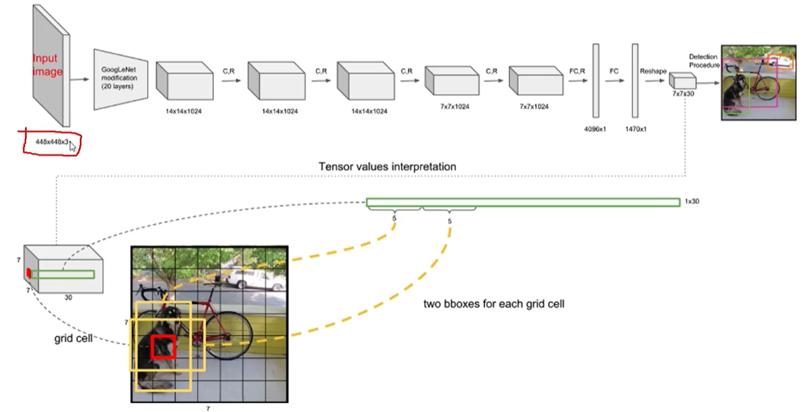

# YOLOv1

* 把检测问题转换为回归问题，一个CNN搞定。
* 主要对视频进行实时检测，应用领域很广!

相对来说，Yolo的算法速度快，检测的目标比较简单；Faster R-CNN 速度慢，检测的目标可以复杂一些。

## 核心思想

## 网络架构

输入是固定的，原因是 FC 层是固定的。

(7\*7)\*30

## 具体含义

数据集中有20个类别。

B是有多少BoudingBox(预测边界框)，B=2 表示有2个预测框。

7\*7 表示最终将FC的输出划分成49块。

## 损失函数

* 位置误差:
  * s平方表示有 s\*s 个块。yolov1是 7\*7
  * B是预测框，yolov1中B=2 

## NMS(非极大值抑制)

## 总结

* 优点: 快速，简单
* 问题
  * 每个Cell只预测一个类别，如果重叠无法解决
  * 小物体检测效果一般，长宽比可选但单一
