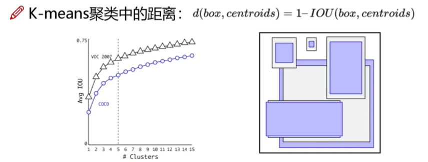

# YOLOv2

> 更快! 更强！

## 改进点

Batch Normalization

* V2版本舍弃了Dropout,卷积后全部加入Batch Normalization
* 网络的每一层的输入都做归一化，收敛相对容易
* 经过Batch Normalization处理后的网络会提升2%的mAP
* 从现在来看，Batch Normalization已经成为网络处理标配

更大的分辨率

* V1版本用的是224\*224，测试用的是 448\*448
* 可能导致模型水土不服，V2训练时额外进行了10次448\*448的微调
* 使用高分辨率分类器后，mAP提升约4%

网络结构的改进

* DarkNet, 实际输入为 416\*416
* 没有FC层，5次降采样。
* 1\*1卷积节省了很多参数

聚类提取先验框

* faster-rcnn系列选择的先验比例都是常规的，但不一定是适合数据集的

* K-means聚类中的距离:

  

Anchor Box

* 通过引入 anchor boxes，使得预测的box数量更多(13\*13\*n)

* 跟faster-rcnn系列不同的是先验框并不是直接安装长宽固定比给定

  

Directed Location Prediction

* V1版本中bbox: 中心为(xp,yp)，宽和高为(wp,hp),则

  tx=1,则将bbox在x轴向右移动wp;tx=-1,则向左移动wp。

  这会导致收敛问题，模型不稳定，尤其是刚开始训练时。

* V2版本中没有直接使用偏移量，而是选择相对grid cell的偏移量

  

* Fine-Grained Features

  

* 图片多尺度 Multi-Scale

  
