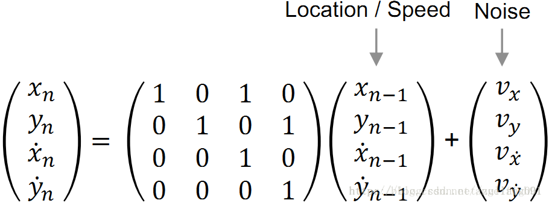

# 卡尔曼滤波

卡尔曼在利用观测数据估计系统状态时，可以滤除观测时存在的噪声，因此这一过程也被看作是一个滤波过程。

## 跟踪鼠标
绿色为测量到的鼠标坐标（位置）

红色为卡尔曼滤波器预测的鼠标坐标（位置）

```
import cv2
import numpy as np

# 创建一个大小800*800的空帧
frame = np.zeros((800, 800, 3), np.uint8)
# 初始化测量坐标和鼠标运动预测的数组
last_measurement = current_measurement = np.array((2, 1), np.float32)
last_predicition = current_prediction = np.zeros((2, 1), np.float32)

def mousemove(event, x, y, s, p):
    """
    mousemove()函数在这里的作用就是传递X,Y的坐标值，便于对轨迹进行卡尔曼滤波
    """
    # 定义全局变量
    global frame, current_measurement, last_measurement, current_prediction, last_prediction
    # 初始化
    last_measurement = current_measurement
    last_prediction = current_prediction
    # 传递当前测量坐标值
    current_measurement = np.array([[np.float32(x)], [np.float32(y)]])
    # 用来修正卡尔曼滤波的预测结果
    kalman.correct(current_measurement)  # 用当前测量来校正卡尔曼滤波器
    # 调用kalman这个类的predict方法得到状态的预测值矩阵，用来估算目标位置
    current_prediction = kalman.predict()
    # 上一次测量值
    lmx, lmy = last_measurement[0], last_measurement[1]
    # 当前测量值
    cmx, cmy = current_measurement[0], current_measurement[1]
    # 上一次预测值
    lpx, lpy = last_prediction[0], last_prediction[1]
    # 当前预测值
    cpx, cpy = current_prediction[0], current_prediction[1]
    # 绘制测量值轨迹（绿色）
    cv2.line(frame, (lmx, lmy), (cmx, cmy), (0, 100, 0))
    # 绘制预测值轨迹（红色）
    cv2.line(frame, (lpx, lpy), (cpx, cpy), (0, 0, 200))


cv2.namedWindow("kalman_tracker")
# 调用函数处理鼠标事件，具体事件必须由回调函数的第一个参数来处理，该参数确定触发事件的类型（点击和移动）
'''
void setMousecallback(const string& winname, MouseCallback onMouse, void* userdata=0)
       winname:窗口的名字
       onMouse:鼠标响应函数，回调函数。指定窗口里每次鼠标时间发生的时候，被调用的函数指针。
                这个函数的原型应该为void on_Mouse(int event, int x, int y, int flags, void* param);
       userdate：传给回调函数的参数
 void on_Mouse(int event, int x, int y, int flags, void* param);
        event是 CV_EVENT_*变量之一
        x和y是鼠标指针在图像坐标系的坐标（不是窗口坐标系）
        flags是CV_EVENT_FLAG的组合， param是用户定义的传递到setMouseCallback函数调用的参数。
    常用的event：
        CV_EVENT_MOUSEMOVE
        CV_EVENT_LBUTTONDOWN
        CV_EVENT_RBUTTONDOWN
        CV_EVENT_LBUTTONUP
        CV_EVENT_RBUTTONUP
        和标志位flags有关的：
        CV_EVENT_FLAG_LBUTTON
'''
cv2.setMouseCallback("kalman_tracker", mousemove)
'''
Kalman这个类需要初始化下面变量：
转移矩阵，测量矩阵，控制向量(没有的话，就是0)，
过程噪声协方差矩阵，测量噪声协方差矩阵，
后验错误协方差矩阵，前一状态校正后的值，当前观察值。
    在此cv2.KalmanFilter(4,2)表示转移矩阵维度为4，测量矩阵维度为2
卡尔曼滤波模型假设k时刻的真实状态是从(k − 1)时刻的状态演化而来，符合下式：
            X(k) = F(k) * X(k-1) + B(k)*U(k) + W（k）
其中
F(k)  是作用在xk−1上的状态变换模型（/矩阵/矢量）。 
B(k)  是作用在控制器向量uk上的输入－控制模型。 
W(k)  是过程噪声，并假定其符合均值为零，协方差矩阵为Qk的多元正态分布。
'''
kalman = cv2.KalmanFilter(4,
                          2)  # 创建kalman滤波器 dynam_params：状态空间的维数；measure_param：测量值的维数；control_params：控制向量的维数，默认为0。由于这里该模型中并没有控制变量，因此也为0。
# 设置测量矩阵
kalman.measurementMatrix = np.array([[1, 0, 0, 0], [0, 1, 0, 0]], np.float32)
# 设置转移矩阵
kalman.transitionMatrix = np.array([[1, 0, 1, 0], [0, 1, 0, 1], [0, 0, 1, 0], [0, 0, 0, 1]], np.float32)
# 设置过程噪声协方差矩阵
kalman.processNoiseCov = np.array([[1, 0, 0, 0], [0, 1, 0, 0], [0, 0, 1, 0], [0, 0, 0, 1]], np.float32) * 0.03

while True:
    cv2.imshow("kalman_tracker", frame)
    if (cv2.waitKey(30) & 0xff) == 27:
        break

cv2.destroyAllWindows()
```

建立鼠标运动的模型，至少有两个状态变量：鼠标位置x,y，也可以是四个状态变量：位置x,y和速度vx，vy。两个测量变量：鼠标位置x,y。

