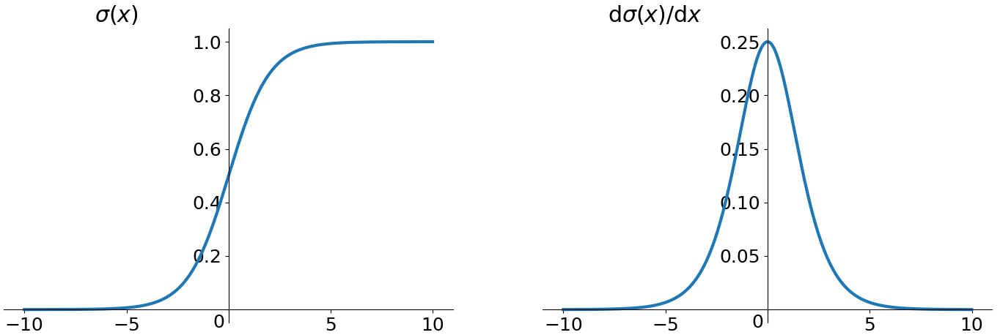
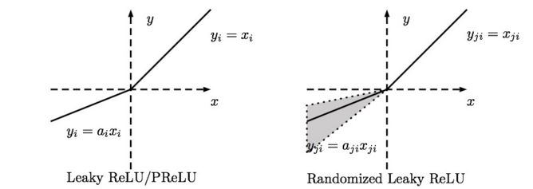
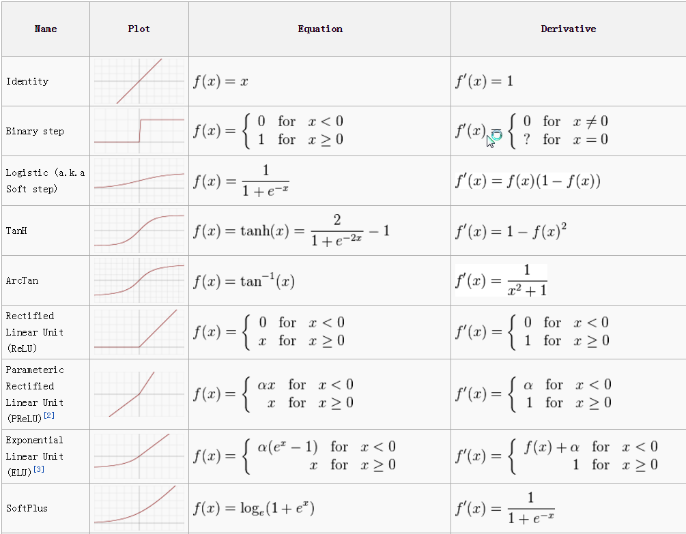
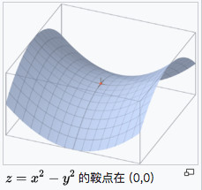

# 激活函数和优化器

深度学习的基本原理是基于人工神经网络，输入信号经过非线性的active function，传入到下一层神经元；再经过下一层神经元的activate，继续往下传递，如此循环往复，直到输出层。正是因为这些active functions的堆砌，深度学习才被赋予了解决非线性问题的能力。当然，仅仅靠active functions还不足于使得深度学习具有"超能力"，训练过程中的优化器对于组织神经网络中的各个神经元起到了至关重要的角色。本文简单汇总一些常用的active functions和optimizers，不求最全，但是尽量保证简单易懂。

## 激活函数

当然，在介绍这些active functions之前，先简单汇总下active functions应该具备的性质。

- 非线性
- 可微性：当优化方法是基于梯度的时候，这个性质是必须的。
- 单调性：当激活函数是单调的时候，单层网络能够保证是凸函数。
- f(x)≈xf(x)≈x：当激活函数满足这个性质的时候，如果参数的初始化是random的很小的值，那么神经网络的训练将会很高效；如果不满足这个性质，那么就需要很用心的去设置初始值。
- 输出值的范围：当激活函数输出值是有限的时候，基于梯度的优化方法会更加稳定，因为特征的表示受有限权值的影响更显著；当激活函数的输出是无限的时候，模型的训练会更加高效，不过在这种情况小，一般需要更小的learning rate.

### 1. sigmoid

sigmoid函数是深度学习中最基本，也是最为常见的一种激活函数。sigmoid函数公式如下：

sigmoid函数的导函数形式为：

函数曲线和导函数曲线分别如下图所示：

 sigmoid函数的优点在于函数平滑且易于求导，但是其缺点也比较突出，例如：

- 容易出现梯度弥散（具体可参考博文《[[Deep Learning\] 深度学习中消失的梯度](http://www.cnblogs.com/maybe2030/p/6336896.html)》）
- 输出不具有zero-centered性质
- 幂运算相对比较耗时

### 2. tanh

tanh读作hyperbolic tangent，相对于sigmoid函数的缺点，它具有zero-centered形式的输出，因此被认为tanh一般总是好于sigmoid，因为函数值介于[-1,1]之间，激活函数的平均值接近于0，这样可以使得下一层的神经元学习的更好。其公式表示如下：

f(x)=ex−e−xex+e−xf(x)=ex−e−xex+e−x

对应的导数形式为：g(x)=1−f(x)2g(x)=1−f(x)2

函数曲线和导函数曲线分别如下图所示：

 

实际上tanh是sigmoid平移后的结果。因为tanh总是优于sigmoid，所以sigmoid目前基本不用，但有一个例外的场景，那就是sigmoid更适合于做二分类系统的输出层。因为sigmoid的输出值介于[0,1]之间，可以很容易的去表征概率。

### 3. ReLU

tanh和sigmoid函数的共同缺点就是当输入*特别小或者特别大时，容易引起梯度弥散或梯度爆炸。而ReLU（Rectified Linear Units）可以在一定程度上缓解梯度弥散和梯度爆炸的问题，使得深度神经网络的训练可以更快速地达到收敛。因此目前神经网络中的隐含层中最为常用的默认激活函数就是ReLU了。其函数形式表示如下：*

f(x)=max(0,x)f(x)=max(0,x)

*函数和导函数曲线如下图所示：*

**

 

通过上图可以发现，ReLU在0点是不可导的，因此ReLU在应用的时候有个小trick，在实践的时候可以将0点的导数强制赋值为0或者1。

ReLU虽然简单，但却是深度学习激活函数方面几乎最为重要的成果，它有以下几大优点：

- 解决了梯度弥散的问题（输出均大于0）
- 计算速度非常快，只需要判断输入是否大于0（阈值计算）
- 收敛速度远快于sigmoid和tanh

但其实ReLU也不是万能的，它的缺点可以简单提两点：

- 输出不是zero-centered
- 具有dying ReLU problem

dying ReLU problem：由于ReLU特殊的函数形式，在训练过程中某些神经元可能永远不会被激活，导致相应的参数永远不能被更新，而且这个问题会随着训练的进行持续恶化。

导致dying ReLU problem的原因主要有两个：

- 初始化，这种概率比较小
- Learning rate太大

dying ReLU problem详细细节可以参考这里：《[What is the "dying ReLU" problem in neural networks?](https://www.quora.com/What-is-the-dying-ReLU-problem-in-neural-networks)》

即使ReLU存在上述问题，但是ReLU目前是应用最为广泛和实用的激活函数。

### 4. Leaky ReLU

Leaky ReLU就是针对dying ReLU problem而进行改进的，相对于ReLU而言，函数前半段不再为0，而是一段线性函数。用公式表达如下：

f(x)=αx,ifx<0f(x)=αx,ifx<0

f(x)=x,ifx≥0f(x)=x,ifx≥0

其中，参数αα一般为远小于1的实数，比如0.01。下图显示了Leaky ReLU的两种函数形式，一种αα为定值，另外一种αα为某范围内的随机值（也被称为Randomized Leaky ReLU）：

除了具备ReLU的所有优点以外，Leaky ReLU不存在dying ReLU problem。从理论上讲，Leaky ReLU应该完全优于ReLU的性能，但是实际应用中并没有表现可以证明Leaky ReLU绝对优于ReLU。

## 5. ELU

同Leaky ReLU一样，ELU（Exponential Linear Unit）也是针对dying ReLU problem提出的。具体公式如下：

f(x)=α(ex−1),ifx<0f(x)=α(ex−1),ifx<0

f(x)=x,ifx≥0f(x)=x,ifx≥0

具体函数曲线如下：

ELU也可以有效地解决dying ReLU problem，而且是近似zero-centered，但随之而来的缺点就是ELU不再是简单的阈值计算，计算相对ReLU稍加复杂。

激活函数汇总

下表汇总了常用的一些active functions：

## 优化器

### 1. batch GD & SGD & Mini-batch GD

三种梯度下降算法可以参考之前博文《[[Machine Learning\] 梯度下降法的三种形式BGD、SGD以及MBGD](http://www.cnblogs.com/maybe2030/p/5089753.html)》

上述三种梯度下降的优化算法均存在如下问题：

- Learning rate如果选择的太小，收敛速度会很慢，如果太大，loss function就会在极小值处不停地震荡甚至偏离。
- 对所有参数更新时应用同样的Learning rate，如果我们的数据是稀疏的，我们更希望对出现频率低的特征进行大一点的更新。
- 对于非凸函数，还要避免陷于局部极小值或者鞍点处，因为鞍点周围的error 是一样的，所有维度的梯度都接近于0，纯梯度下降很容易被困在这里。

关于鞍点的解释：

　　鞍点：一个光滑函数的鞍点邻域的曲线，曲面，或超曲面，都位于这点的切线的不同边。 例如下图这个二维图形，像个马鞍：在x轴方向往上曲，在y轴方向往下曲，鞍点就是(0,0)。

目前对于优化器的研究基本围绕上述三个问题进行展开。

### 2. Momentum

SGD算法的更新公式如下：

W:=W−αdWW:=W−αdW

b:=b−αdbb:=b−αdb

我们可以示意化的画出SGD优化路线图如下：

Momentum的改进思想是针对SGD算法波动大、收敛速度慢问题，简单来说就是防止波动，取前几次波动的均值作为新的参数值。Momentum利用了梯度的指数加权平均数，引入了一个新的超参数ββ（一般取0.9），具体更新公式如下：

VdW=βVdW+(1−β)dWVdW=βVdW+(1−β)dW

Vdb=βVdb+(1−β)dbVdb=βVdb+(1−β)db

W:=W−αVdWW:=W−αVdW

b:=b−αVdbb:=b−αVdb

改进后的Momentum优化路线示意图如下：

Momentum背后的物理含义可以简单的这样理解：

当我们将一个小球从山上滚下来时，没有阻力的话，它的动量会越来越大，但是如果遇到了阻力，速度就会变小。 加入这一项，可以使得梯度方向不变的维度上速度变快，梯度方向有所改变的维度上的更新速度变慢，这样就可以加快收敛并减小震荡。

### 3. RMSprop

RMSprop是Geoff Hinton提出的一种自适应学习率方法，全称为Root Mean Square Prop，它的基本思想和Momentum类似，同样引入了额外的超参数ββ（一般取值0.999），其更新公式如下：

SdW=βSdW+(1−β)dW2SdW=βSdW+(1−β)dW2

Sdb=βSdb+(1−β)db2Sdb=βSdb+(1−β)db2

W:=W−αdWSdW−−−−√W:=W−αdWSdW

b:=b−αdbSdb−−−√b:=b−αdbSdb

针对上述更新公式，为了防止WW和bb更新过程中分母项为0，一般在应用中加上特别小的一个实数ϵϵ（一般取值为10−810−8）：

W:=W−αdWSdW+ϵ−−−−−−√W:=W−αdWSdW+ϵ

b:=b−αdbSdb+ϵ−−−−−−√b:=b−αdbSdb+ϵ

RMSprop示意图如下：

具体关于RMSprop更详细的讲解可以参考这篇博文《[机器学习中使用的神经网络第六讲笔记](https://blog.csdn.net/majordong100/article/details/51428642)》

### 4. Adam

研究者们其实提出了很多的优化算法，可以解决一些特定的优化问题，但是很难扩展到多种神经网络。而Momentum，RMSprop是很长时间来最经得住考研的优化算法，适合用于不同的深度学习结构。所以有人就有想法，何不将这俩的方法结合到一起呢？Adam算法，全称Adaptive Moment Estimation，就随即问世了。由于Adam是Momentum+RMSprop，所以需要引入两个超参数，我们表示为β1=0.9β1=0.9，β2=0.999β2=0.999。

VdW=β1VdW+(1−β1)dWVdW=β1VdW+(1−β1)dW

Vdb=β1Vdb+(1−β1)dbVdb=β1Vdb+(1−β1)db

SdW=β2SdW+(1−β2)dW2SdW=β2SdW+(1−β2)dW2

Sdb=β2Sdb+(1−β2)db2Sdb=β2Sdb+(1−β2)db2

VcorrecteddW=VdW1−βt1VdWcorrected=VdW1−β1t

Vcorrecteddb=Vdb1−βt2Vdbcorrected=Vdb1−β2t

ScorrecteddW=SdW1−βt1SdWcorrected=SdW1−β1t

Scorrecteddb=Sdb1−βt2Sdbcorrected=Sdb1−β2t

W:=W−αVdWScorrecteddW−−−−−−−√W:=W−αVdWSdWcorrected

b:=b−αVdbScorrecteddb−−−−−−−√b:=b−αVdbSdbcorrected

因为Adam结合上述两种优化算法的优点于一身，所以现在经常用的是Adam优化算法。

5. 各Optimizers优化效果
除了上述三种常用的改进算法，还有例如Adagrad等Optimizer，这里就不一一介绍了，感兴趣的可以去了解下各算法改进的motivation。

下面两个图分别展示了几种算法在鞍点和等高线上的表现：

## 参考

1. Adrew Ng 深度学习课程
2. [谷歌考察：深度学习的activation function哪家强](http://www.sohu.com/a/127679690_410611)
3. [仙道菜的博客](https://blog.csdn.net/cyh_24/article/details/50593400)
4. [Marcovaldong的博客](https://blog.csdn.net/majordong100/article/details/51428642)
5. [关于深度学习优化器optimizer的选择，你需要了解这些](https://www.leiphone.com/news/201706/e0PuNeEzaXWsMPZX.html)