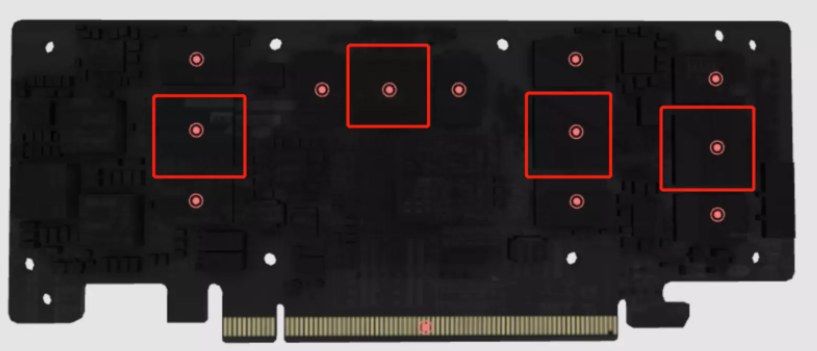
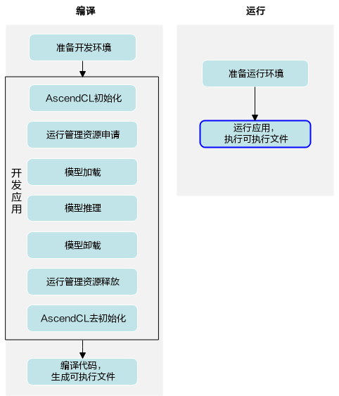

# 基于昇腾CANN的ACL推理应用开发原理（C++）

在本节中，在本节中，您可以了解基于昇腾CANN的AscendCL接口图片分类应用开发过程，以及涉及的CANN相关概念。

## 实验内容及目标

- **学完本课程，您应该能够：**

    了解ACL的基本概念，清楚 ACL的能力和作用
    
    了解ACL定义的编程模型，理解各类运行资源的概念及其相互关系
    
    能够区分Host和Device的概念，并学会管理这两者各自的内存
    
    加载一个离线模型进行推理，并为推理准备输入输出数据结构
    

- **为了达成上述目标，您应该具备如下知识：**

    熟练的C/C++语言编程能力
    
    深度学习基础知识，理解神经网络模型输入输出数据结构


## 什么是AscendCL？
AscendCL（Ascend Computing Language）是一套用于在昇腾平台上开发深度神经网络推理应用的C语言API库，提供Device管理、Context管理、Stream管理、内存管理、模型加载与执行、算子加载与执行、媒体数据处理等API，能够实现在昇腾CANN平台上进行深度学习推理计算、图形图像预处理、单算子加速计算等能力。

## 了解如下基本概念
Host、Device、Context、Stream的概念如下：

- Host

  Host指与Device相连接的X86服务器、ARM服务器，会利用Device提供的NN（Neural-Network ）计算能力，完成业务。

- Device

  Device指安装了芯片的硬件设备，利用PCIe接口与Host侧连接，提供NN计算能力。

  广义的Device泛指安装了NPU的硬件设备，以Atlas300I为例：
  
  
  
  其利用PCIe接口与主机（Host）侧连接，为Host提供NN计算能力。广义的Device既包含芯片，也包含板上的内存等其它设备。

  而当我们打开这个设备：

  
  
  
  上边焊接了4片昇腾310AI处理器，狭义的Device特指这几个芯片。
  
- Context

  Context作为一个容器，管理了所有对象（包括Stream、Event、设备内存等）的生命周期。不同Context的Stream、不同Context的Event是完全隔离的，无法建立同步等待关系。

  多线程编程场景下，每切换一个线程，都要为该线程指定当前Context，否则无法获取任何其他运行资源。该部分更多细节我们在“同步等待”实验中深入讨论。

- Stream

  Stream用于维护一些异步操作的执行顺序，确保按照应用程序中的代码调用顺序在Device上执行。

  基于Stream的kernel执行和数据传输能够实现Host运算操作、Host与Device间的数据传输、Device内的运算并行。

  同步接口在调用的时候，当前线程会阻塞在调用点等待接口执行结束返回；而异步接口在调用之后会立即返回，此类接口在调用的时候要指定一个Stream作为执行队列，以保证多个异步调用按照调用顺序执行。


## 了解入门应用场景
通过AscendCL提供的接口可以开发出图片分类的应用，如下：

1.  一张需要分类的图片，需要1张原始RBG图片，且图像各参数完全匹配Resnet50输入。
2.  一个Resnet50预训练模型文件（.om），此模型由caffe/TensorFlow等预训练模型转换而来。
3.  最终我们将打印出推理结果中置信度前五的标签及其对应置信度，通过标签查阅其对应的类别。标签和类型的对应关系与训练模型时使用的数据集有关，例如，若使用imagenet数据集，则需要查阅该数据集的标签及类别的对应关系。


如果想体验下该应用样例，请执行如下脚本。


```python
!./run_resnet50.sh
```

```
[INFO]  acl init success
[INFO]  open device 0 success
[INFO]  create context success
[INFO]  create stream success
[INFO]  get run mode success
[INFO]  load model ../model/resnet50.om success
[INFO]  create model description success
[INFO]  create model output success
[INFO]  start to process file:../data/dog1_1024_683.bin
[INFO]  model execute success
[INFO]  top 1: index[161] value[0.767578]
[INFO]  top 2: index[162] value[0.154785]
[INFO]  top 3: index[167] value[0.038513]
[INFO]  top 4: index[163] value[0.021606]
[INFO]  top 5: index[166] value[0.011658]
[INFO]  output data success
[INFO]  unload model success, modelId is 1
[INFO]  execute sample success
[INFO]  end to destroy stream
[INFO]  end to destroy context
[INFO]  end to reset device is 0
[INFO]  end to finalize acl
```

## 了解开发过程

我们已经了解入门应用场景后，那如何开发这个应用？

1.  准备开发环境，开发环境需要部署编译器、AscendCL组件的头文件和库文件等，便于您在完成应用的代码开发后，编译代码时使用。
2.  开发应用，使用AscendCL提供的接口编写应用的代码逻辑。
3.  编译代码，完成代码开发后，需要将代码编译成可执行文件，便于后续使用。
4.  准备运行环境，运行环境上需要部署应用的可执行文件需依赖的库文件，运行应用时使用。
5.  运行应用，最后验证应用的运行结果。



了解了这些大步骤后，下面我们再展开来说明开发应用具体涉及哪些关键功能？各功能又使用哪些AscendCL接口，这些AscendCL接口怎么串联？

可能现在您还不理解所有细节，但这也不影响，快速入门旨在帮助您快速了解整体的代码逻辑。

## 开发应用时的代码逻辑
此处仅仅是关键步骤的代码示例，不可以直接拷贝编译运行，仅供参考 。

1.include依赖的AscendCL的头文件
    # include "acl/acl.h"
2.AscendCL初始化

使用AscendCL接口开发应用时，必须先初始化，否则可能会导致后续系统内部资源初始化出错，进而导致其它业务异常。

aclInit接口的aclConfigPath参数是指在初始化时加载的配置文件的路径，可以通过这个配置文件来配置Dump信息用于比对精度、配置Profiling信息用于调试性能、配置算子缓存信息老化功能用于为节约内存和平衡调用性能。当前默认是关闭Dump配置、Profiling配置，且算子缓存信息老化配置有默认值，如果当前的默认配置已满足需求，或您不关注这些配置，可向aclInit接口中传入NULL，或者可将配置文件配置为空json串（即配置文件中只有\{\}）。
```
# 此处的..表示相对路径，相对可执行文件所在的目录
# 例如，编译出来的可执行文件存放在out目录下，此处的..就表示out目录的上一级目录
const char *aclConfigPath = "../src/acl.json";
aclError ret = aclInit(aclConfigPath);
```

有初始化就有去初始化，在确定完成了AscendCL的所有调用之后，或者进程退出之前，需调用接口实现AscendCL去初始化，请参见[8.AscendCL去初始化](#p1)。

3.运行管理资源申请

您需要按顺序依次申请如下资源：Device、Context、Stream，确保可以使用这些资源执行运算、管理任务。

aclrtSetDevice这个接口，调用完毕后，除了指定了计算设备之外，还会同时创建1个默认的Context；而这个默认的Context还附赠了2个Stream，1个默认Stream和1个用于执行内部同步的Stream。这也意味着如果是编写非常简单的单线程同步推理应用，在运行资源这里我们只需要调用aclrtSetDevice就够了。
```
# 1 指定运算的Device
ret = aclrtSetDevice(deviceId_);

# 2 显式创建一个Context，用于管理Stream对象
ret = aclrtCreateContext(&context_, deviceId_);

# 3 显式创建一个Stream
# 用于维护一些异步操作的执行顺序，确保按照应用程序中的代码调用顺序执行任务
ret = aclrtCreateStream(&stream_);

# 4 获取当前昇腾AI软件栈的运行模式，根据不同的运行模式，后续的接口调用方式不同
aclrtRunMode runMode;
extern bool g_isDevice;
ret = aclrtGetRunMode(&runMode);
g_isDevice = (runMode == ACL_DEVICE); 
```
有运行管理资源的申请，自然也有对应的释放接口，所有数据处理都结束后，需要按顺序释放运行管理资源：Stream、Context、Device，请参见[7.运行管理资源释放](#p2)。

4.模型加载，并获取模型描述信息

如果基于网络模型开发推理应用，那就必须得先有模型，将模型加载到AscendCL中。AscendCL只认识适配昇腾AI处理器的离线模型（\*.om文件），因此，模型加载前，需要将第三方网络（例如，Caffe ResNet-50网络）转换为适配昇腾AI处理器的离线模型（\*.om文件），请参见《[ATC工具使用指南](https://ascend.huawei.com/#/document?tag=community-developer)》。
```
# 1 初始化变量
# 此处的..表示相对路径，相对可执行文件所在的目录
# 例如，编译出来的可执行文件存放在out目录下，此处的..就表示out目录的上一级目录
const char* omModelPath = "../model/resnet50.om"

# 2 根据模型文件获取模型执行时所需的权值内存大小、工作内存大小。
aclError ret = aclmdlQuerySize(omModelPath, &modelMemSize_, &modelWeightSize_);

# 3 根据工作内存大小，申请Device上模型执行的工作内存。
ret = aclrtMalloc(&modelMemPtr_, modelMemSize_, ACL_MEM_MALLOC_NORMAL_ONLY);

# 4 根据权值内存的大小，申请Device上模型执行的权值内存。
ret = aclrtMalloc(&modelWeightPtr_, modelWeightSize_, ACL_MEM_MALLOC_NORMAL_ONLY);

# 5 加载离线模型文件（适配昇腾AI处理器的离线模型），由用户自行管理模型运行的内存(包括权值内存、工作内存)。
# 模型加载成功，返回标识模型的ID。
ret = aclmdlLoadFromFileWithMem(modelPath, &modelId_, modelMemPtr_, modelMemSize_, modelWeightPtr_, modelWeightSize_);

# 6 根据加载成功的模型的ID，获取该模型的描述信息。
# modelDesc_为aclmdlDesc类型。
modelDesc_ = aclmdlCreateDesc();
ret = aclmdlGetDesc(modelDesc_, modelId_);
```
有加载就有卸载，模型推理结束后，需要卸载模型，请参见[6.卸载模型](#p3)。

5.执行模型推理，并处理推理结果，打印出推理结果中置信度前五的标签及其对应置信度

1. 准备模型推理的输入、输出数据结构，用于描述模型的输入、输出数据。
```
# 1 准备模型推理的输入数据结构
# 1.1申请输入内存
size_t modelInputSize;
void *modelInputBuffer = nullptr;

# 当前示例代码中的模型只有一个输入，所以index为0
# 如果模型有多个输入，则需要先调用aclmdlGetNumInputs接口获取模型输入的数量
modelInputSize = aclmdlGetInputSizeByIndex(modelDesc_, 0);
aclRet = aclrtMalloc(&modelInputBuffer, modelInputSize, ACL_MEM_MALLOC_NORMAL_ONLY);

# 1.2准备模型的输入数据结构
# 创建aclmdlDataset类型的数据，描述模型推理的输入，input_为aclmdlDataset类型
input_ = aclmdlCreateDataset();
aclDataBuffer *inputData = aclCreateDataBuffer(modelInputBuffer, modelInputSize);
ret = aclmdlAddDatasetBuffer(input_, inputData);

# 2 准备模型推理的输出数据结构
# 2.1创建aclmdlDataset类型的数据，描述模型推理的输出，output_为aclmdlDataset类型
output_ = aclmdlCreateDataset();

# 2.2获取模型的输出个数
size_t outputSize = aclmdlGetNumOutputs(modelDesc_);

# 2.3循环为每个输出申请内存，并将每个输出添加到aclmdlDataset类型的数据中.
for (size_t i = 0; i < outputSize; ++i) {
    size_t buffer_size = aclmdlGetOutputSizeByIndex(modelDesc_, i);
    void *outputBuffer = nullptr;
    aclError ret = aclrtMalloc(&outputBuffer, buffer_size, ACL_MEM_MALLOC_NORMAL_ONLY);
    aclDataBuffer* outputData = aclCreateDataBuffer(outputBuffer, buffer_size);   
    ret = aclmdlAddDatasetBuffer(output_, outputData);
}

```
2. 准备模型推理的输入数据，进行推理，推理结束后，处理推理结果。

向内存中读入模型推理的输入数据，再进行推理。

推理结束后，处理推理结果，打印出推理结果中置信度前五的标签及其对应置信度。

处理结果后，需释放模型推理的输入、输出资源，防止内存泄露。
```
string picturePath = "../data/dog1_1024_683.bin";
# 1 自定义函数ReadBinFile，调用C++标准库std::ifstream中的函数读取图片文件
# 输出图片文件占用的内存大小inputBuffSize以及图片文件存放在内存中的地址inputBuff    
void *inputBuff = nullptr;
uint32_t inputBuffSize = 0;
auto ret = Utils::ReadBinFile(picturePath, inputBuff, inputBuffSize);

# 2 准备模型推理的输入数据
# 在"申请运行管理资源"时调用aclrtGetRunMode接口获取软件栈的运行模式
# 如果运行模式为ACL_DEVICE，则g_isDevice参数值为true，无需传输图片数据或在Device内传输数据 
# 如果运行模式为ACL_HOST，则g_isDevice参数值为false，需要将图片数据从Host传输到Device
if (!g_isDevice) {
    # 内存在"输入/输出数据结构准备"时申请该内存
    aclError aclRet = aclrtMemcpy(modelInputBuffer, modelInputSize, inputBuff, inputBuffSize, ACL_MEMCPY_HOST_TO_DEVICE);
    (void)aclrtFreeHost(inputBuff);
    } 
else { 
    aclError aclRet = aclrtMemcpy(modelInputBuffer, modelInputSize, inputBuff, inputBuffSize, ACL_MEMCPY_DEVICE_TO_DEVICE);
    (void)aclrtFree(inputBuff);
    }

# 3. 执行模型推理
# modelId_表示模型ID，在"模型加载"成功后，会返回标识模型的ID
# input_、output_分别表示模型推理的输入、输出数据，在"准备模型推理的输入、输出数据结构"时已定义
aclError ret = aclmdlExecute(modelId_, input_, output_)

# 4. 处理模型推理的输出数据，输出top5置信度的类别编号 
for (size_t i = 0; i < aclmdlGetDatasetNumBuffers(output_); ++i) {
    # 获取每个输出的内存地址和内存大小
    aclDataBuffer* dataBuffer = aclmdlGetDatasetBuffer(output_, i);
    void* data = aclGetDataBufferAddr(dataBuffer);

    size_t len = aclGetDataBufferSizeV2(dataBuffer);

    # 将内存中的数据转换为float类型
    float *outData = NULL;
    outData = reinterpret_cast<float*>(data);

    # 屏显每张图片的top5置信度的类别编号
    map<float, int, greater<float> > resultMap;
    for (int j = 0; j < len / sizeof(float); ++j) {
        resultMap[*outData] = j;
        outData++;
    }
    int cnt = 0;
    for (auto it = resultMap.begin(); it != resultMap.end(); ++it) {
        #  print top 5
        if (++cnt > 5) {
            break;
        }

        INFO_LOG("top %d: index[%d] value[%lf]", cnt, it->second, it->first);
    }

# 5 释放模型推理的输入、输出资源
# 释放输入资源，包括数据结构和内存
for (size_t i = 0; i < aclmdlGetDatasetNumBuffers(input_); ++i) {
        aclDataBuffer *dataBuffer = aclmdlGetDatasetBuffer(input_, i);
        (void)aclDestroyDataBuffer(dataBuffer);
}
(void)aclmdlDestroyDataset(input_);
input_ = nullptr;
aclrtFree(modelInputBuffer);

# 释放输出资源，包括数据结构和内存
for (size_t i = 0; i < aclmdlGetDatasetNumBuffers(output_); ++i) {
    aclDataBuffer* dataBuffer = aclmdlGetDatasetBuffer(output_, i);
    void* data = aclGetDataBufferAddr(dataBuffer);
    (void)aclrtFree(data);
    (void)aclDestroyDataBuffer(dataBuffer);
}

(void)aclmdlDestroyDataset(output_);
output_ = nullptr;
```
### 卸载模型，并释放模型描述信息

推理结束，需及时卸载模型，并释放相关的工作内存、权值内存。
```
# 1. 卸载模型
aclError ret = aclmdlUnload(modelId_);

# 2. 释放模型描述信息
if (modelDesc_ != nullptr) {
    (void)aclmdlDestroyDesc(modelDesc_);
    modelDesc_ = nullptr;
}

# 3. 释放模型运行的工作内存
if (modelWorkPtr_ != nullptr) {
    (void)aclrtFree(modelWorkPtr_);
    modelWorkPtr_ = nullptr;
    modelWorkSize_ = 0;
}

# 4. 释放模型运行的权值内存
if (modelWeightPtr_ != nullptr) {
    (void)aclrtFree(modelWeightPtr_);
    modelWeightPtr_ = nullptr;
    modelWeightSize_ = 0;
}
```
### 运行管理资源释放

要注意，只能销毁由aclrtCreateContext接口显式创建的Context、销毁由aclrtCreateStream接口显式创建的Stream，不能销毁默认Context、默认Stream。默认Context、默认Stream会由系统自行销毁，无需调用者关注。
```
# 1 释放Stream
aclError ret = aclrtDestroyStream(stream_);
# 2 释放Context
ret = aclrtDestroyContext(context_);
# 3 释放Device
ret = aclrtResetDevice(deviceId_);
```

### AscendCL去初始化
在确定完成了AscendCL的所有调用之后，或者进程退出之前，需调用如下接口实现AscendCL去初始化。
```
aclError ret = aclFinalize();
```

## 结语

至此，ACL推理应用开发体验结束。让我们回顾一下ACL推理应用开发整体流程：
1.AscendCL初始化

2.运行管理资源申请

3.模型加载，并获取模型描述信息

4.执行模型推理，并处理推理结果，打印出推理结果中置信度前五的标签及其对应置信度

5.卸载模型，并释放模型描述信息

6.运行管理资源释放

7.AscendCL去初始化
