# PyTorch框架使用DSL进行TBE算子开发全流程

> 视频流程可以访问 [MindStudio TBE DSL算子开发 LP_NORM_哔哩哔哩_bilibili](https://link.zhihu.com/?target=https%3A//www.bilibili.com/video/BV1WZ4y1a74i)

## 1. DSL算子基本概念介绍

### 1.1 什么是算子

深度学习算法由一个个计算单元组成，我们称这些计算单元为算子（Operator，简称 OP）。在网络模型中，算子对应层中的计算逻辑，例如：卷积层（Convolution Layer）是一个算子；全连接层（Fully-connected Layer， FC layer）中的权值求和过 程，是一个算子。 对每一个独立的算子，用户需要编写算子描述文件，描述算子的整体逻辑、计算步骤以及相关硬件平台信息等。然后用深度学习编译器对算子描述文件进行编译，生成可在特定硬件平台上运行的二进制文件后，将待处理数据作为输入，运行算子即可得到期望输出。将神经网络所有被拆分后的算子都按照上述过程处理后， 再按照输入输出关系串联起来即可得到整网运行结果。


算子全流程执行

### 1.2 什么是TBE算子

TBE（Tensor Boost Engine）提供了基于开源深度学习编译栈TVM框架的自定义算子开发能力，通过TBE提供的API可以完成相应神经网络算子的开发。

一个完整的TBE算子包含四部分：算子原型定义、对应开源框架的算子适配插件、算子信息库定义和算子实现。


TBE算子全流程执行

昇腾AI软件栈提供了TBE（Tensor Boost Engine：张量加速引擎）算子开发框架，开发者可以基于此框架使用Python语言开发自定义算子，通过TBE进行算子开发有以下几种方式：

- DSL（Domain-Specific Language）开发
- TIK（Tensor Iterator Kernel）开发

### 1.3 什么是DSL算子

为了方便开发者进行自定义算子开发，TBE（Tensor Boost Engine）提供了一套计算接口供开发者用于组装算子的计算逻辑，使得70%以上的算子可以基于这些接口进行开发，极大的降低自定义算子的开发难度。TBE提供的这套计算接口，称之为DSL（Domain-Specific Language）。基于DSL开发的算子，可以直接使用TBE提供的Auto Schedule机制，自动完成调度过程，省去最复杂的调度编写过程。


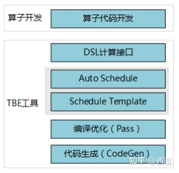

DSL算子介绍

### 1.3.1 DSL功能框架

1. 开发者调用TBE提供的DSL接口进行计算逻辑的描述，指明算子的计算方法和步骤。
2. 计算逻辑开发完成后，开发者可调用Auto Schedule接口，启动自动调度，自动调度时TBE会根据计算类型自动选择合适的调度模板，完成数据切块和数据流向的划分，确保在硬件执行上达到最优。
3. Auto Schedule调度完成后，会生成类似于TVM的I R（Intermediate Representation）的中间表示。
4. 编译优化（Pass）会对算子生成的IR进行编译优化，优化的方式有双缓冲（Double Buffer）、流水线（Pipeline）同步、内存分配管理、指令映射、分块适配矩阵计算单元等。
5. 算子经Pass处理后，由CodeGen生成类C代码的临时文件，这个临时代码文件可通过编译器生成算子的实现文件，可被网络模型直接加载调用。

### 1.3.2 DSL计算接口

TBE DSL提供的计算接口主要涵盖向量运算，包括Math、NN、Reduce、卷积、矩阵计算等接口。

## 2. 算子开发流程介绍

算子开发通常包括以下步骤：

- 环境准备：配置MindStudio算子开发环境
- 算子分析：明确算子的功能及数学表达式，选择算子开发方式
- 工程创建：利用MindStudio创建算子工程
- 算子原型定义：规定在昇腾AI处理器上可运行算子的约束
- 算子代码实现：使用DSL或TIK实现算子
- 算子信息库定义：规定算子在昇腾AI处理器上的具体实现规格
- 算子UT测试：测试算子代码的正确性
- 算子工程编译：编译出可直接安装的自定义算子run包
- 算子工程部署：将自定义算子部署到opp算子库
- 算子ST测试：在真实的硬件环境中，使用离线模型验证算子功能的正确性


算子开发流程介绍

## 3.算子分析

进行算子开发前，开发者应首先进行算子分析，算子分析包含：明确算子的功能及数学表达式，选择算子开发方式（DSL方式或者TIK方式），最后细化并明确算子规格，分析流程如下所示：


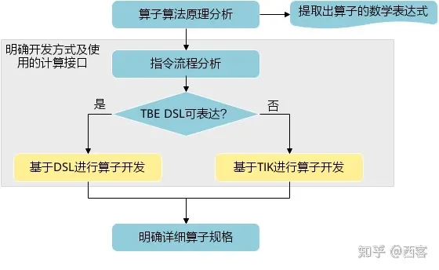

TBE开发流程介绍

### 3.1分析算子算法原理，提取算子的数学表达式


### 3.2明确算子开发方式及使用的计算接口

lp_norm 用到的算子有 + ，幂次方，取最大值，取绝对值 *+：可通过tbe.dsl.vadd接口实现。* 取最大值：可以通过tbe.dsl.reduce_max接口实现。 *取绝对值：可以通过tbe.dsl.vabs接口实现* 幂次方：可以通过tbe.dsl.vmuls, tbe.dsl.exp , tbe.dsl.log 接口实现

通过如上分析，可看出TBE DSL接口满足lp_norm算子的实现要求，所以可优先选择TBE DSL方式进行lp_norm算子的实现。

## 4.创建Pytorch TBE DSL算子工程

### 4.1安装和配置环境

按照[MindStudio用户手册](https://link.zhihu.com/?target=https%3A//www.hiascend.com/document/detail/zh/mindstudio/304/progressiveknowledge/index.html)中的安装指南-->安装操作来安装MindStudio。

除了手册中要求的环境依赖，也需要安装tensorflow，推荐1.15版本

如果采用windows和linux 的公开发环境，需要在本地和远端均配置好所需环境。

### 4.2创建工程


创建工程1


创建工程2

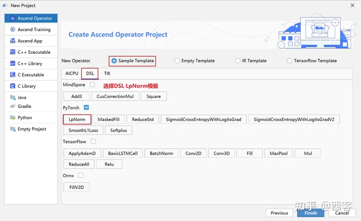

创建工程3

- 创建工程成功

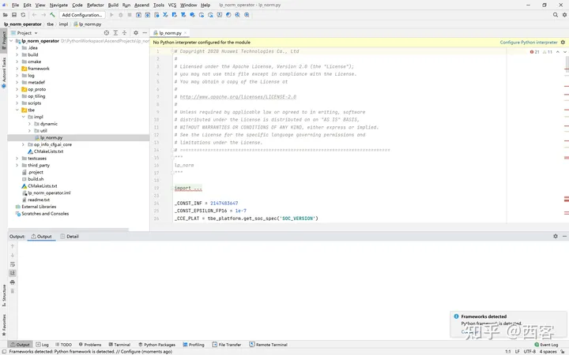

创建工程成功

- 设置python SDK

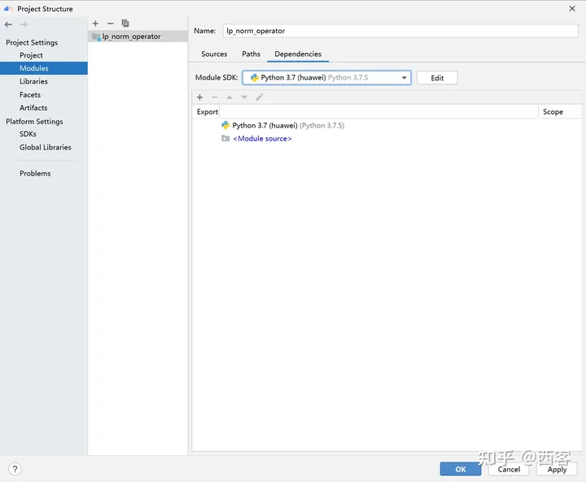

设置python SDK

## 5.算子工程结构和交付件介绍

```text
lp_norm:
├─.idea
├─build                               //编译生成的中间文件
├─cmake
├─cmake-build
├─framework
├─log
├─metadef
├─op_proto                            //算子IR定义文件夹
│  ├─lp_norm.cc                       //算子IR定义
│  ├─lp_norm.h                         //算子IR定义
├─op_tiling
├─out
├─profiling
├─scripts
├─tbe
│  ├─impl
│  │  ├─dynamic                        //dynamic operator
│  │  ├─util                            //工具类
│  │  └─lp_norm.py                        //算子python实现
│  └─op_info_cfg
│      └─ai_core
│          ├─ascend310
│          ├─ascend710
│          └─ascend910
│              └─lp_norm.ini            //ascend910算子信息库文件
├─testcases                                    //UT、ST测试相关目录
│  ├─st                                        //ST测试相关目录
│  │  ├─lp_norm
│  │  │  └─ascend310
│  │  │     └─LpNorm_case_20210527144255.json     //ST测试用例
│  └─ut                                        //UT测试相关目录
│      └─ops_test
│          └─lp_norm
│              └─test_lp_norm_impl.py          //UT测试入口及测试用例                      
├─third_party                                  //工程第三方依赖
└─CMakeLists.txt                                 //编译规则文件
```

### 5.1 lp_norm算子原型

lp_norm算子的原型为pytorch中的torch.norm

```text
torch.norm(input, p='fro', dim=None, keepdim=False, out=None, dtype=None)
```

### 5.2 算子python实现代码

```text
def lp_norm(x, y, p=2, axes=None, keepdim=False, epsilon=1e-12, kernel_name="lp_norm"):
    # 算子校验
    para_check.check_kernel_name(kernel_name)
    xtype_list = ["float16", "float32"]
    x_type = x.get("dtype").lower()
    x_shape = x.get("shape")
    para_check.check_dtype(x_type, xtype_list)
    para_check.check_shape(x_shape)
    p_inf_list = ("inf", "-inf")
    no_shape = len(x_shape)
    if isinstance(axes, int):
        axes = [axes]
    if axes is None:
        axes = [i for i in range(no_shape)]
    if len(axes) == 0:
        axes = [i for i in range(no_shape)]
    input_data = tvm.placeholder(x_shape, dtype=x_type, name="input_data")
    abs_data = tbe.vabs(input_data)    #对所有输入取绝对值
    # 对p分情况
    if (p in p_inf_list) or (p == _CONST_INF) or (p == -_CONST_INF - 1):
        res = lp_norm_inf_compute(abs_data, x_type, y, p, axes, keepdim, kernel_name)
    elif p == 0:
        res = lp_norm0_compute(abs_data, x_type, y, axes, keepdim, kernel_name)
    elif p == 1:
        res = lp_norm1_compute(abs_data, x_type, y, axes, keepdim, kernel_name)
    elif p == 2:
        res = lp_norm2_compute(abs_data, x_type, y, axes, keepdim, kernel_name)
    else:
        res = lp_norm_compute(abs_data, x_type, y, p, axes, keepdim, kernel_name)

    if x_type == "float16" and float(epsilon) <= _CONST_EPSILON_FP16:
        std_no = tvm.const(_CONST_EPSILON_FP16, dtype=x_type)
    else:
        std_no = tvm.const(float(epsilon), dtype=x_type)
    res = tbe.vmaxs(res, std_no)
    # 自动调度
    with tvm.target.cce():
        schedule = tbe.auto_schedule(res)
    # 算子编译
    config = {"name": kernel_name,
              "tensor_list": [input_data, res]}
    tbe.cce_build_code(schedule, config)
```

- 无穷范数的计算


```text
if (p == "inf") or (p == _CONST_INF):
    res = tbe.reduce_max(abs_x, axis=axes, keepdims=keepdim, priority_flag=True) #对所有值取最大值
 else:
        # p is "-inf"
    res = tbe.reduce_min(abs_x, axis=axes, keepdims=keepdim, priority_flag=True) #当p为-inf对所有值取最小值
```

- 0范数的计算
- 0范数表示向量中非零元素的个数（即为其稀疏度）

```text
zero_tensor = tbe.vmuls(abs_x, tvm.const(0, dtype=abs_x.dtype))
one_tensor = tbe.vadds(zero_tensor, tvm.const(1, dtype=abs_x.dtype))
ele_tensor = tbe.vcmpsel(abs_x, zero_tensor, 'ne', one_tensor, zero_tensor)
res = tbe.sum(ele_tensor, axis=axes, keepdims=keepdim)
```

- 1范数的计算


```text
res = tbe.sum(abs_x, axis=axes, keepdims=keepdim) #对所有值求和
```

- 2范数的计算


```text
pow_x = tbe.vmul(abs_x, abs_x)   #求平方
sum_pow = tbe.sum(pow_x, axis=axes, keepdims=keepdim) #求和
res = tbe.vsqrt(sum_pow, priority_flag=1) #求1/2次方
```

- p范数的计算


```text
prod_x = abs_x
for p_ix in range(1, p):  #求p次方
    prod_x = tbe.vmul(prod_x, abs_x)
sum_prod_x = tbe.sum(prod_x, axis=axes, keepdims=keepdim)  #求和
# 将x的p次方转化 x^p -->  exp(log(x)/p)
if "910" in _CCE_PLAT:
    log_sum_x = tbe.vlog(sum_prod_x, priority_flag=1)  #取对数
else:
    log_sum_x = tbe.vlog(sum_prod_x)
zero_tensor = tbe.vmuls(log_sum_x, tvm.const(0, dtype=log_sum_x.dtype))  
p_tensor = tbe.vadds(zero_tensor, tvm.const(p, dtype=log_sum_x.dtype))
div_log_x = tbe.vdiv(log_sum_x, p_tensor)  #除以p
exp_div_x = tbe.vexp(div_log_x)  #e的幂次方
```

## 6.介绍算子原型库、算子信息库代码

算子原型定义规定了在昇腾AI处理器上可运行算子的约束，主要体现算子的数学含义，包含定义算子输入、输出和属性信息，基本参数的校验和shape的推导，原型定义的信息会被注册到GE的算子原型库中。网络模型生成时，GE会调用算子原型库的校验接口进行基本参数的校验，校验通过后，会根据原型库中的推导函数推导每个节点的输出shape与dtype，进行输出tensor的静态内存的分配。

算子的IR用于进行算子的描述，包括算子输入输出信息，属性信息等，用于把算子注册到算子原型库中。

算子的IR需要在算子的工程目录的/op_proto/算子名称.h 和 /op_proto/算子名称.cc文件中进行实现。

### 6.1算子 IR 头文件.h 注册代码实现

```text
#ifndef GE_OP_LP_NORM_H
#define GE_OP_LP_NORM_H
//头文件
#include "graph/operator_reg.h"
#include "graph/operator.h"

namespace ge {
//    原型注册
REG_OP(LpNorm)
    .INPUT(x, TensorType({DT_FLOAT16, DT_FLOAT}))
    .OUTPUT(y, TensorType({DT_FLOAT16, DT_FLOAT}))
    .ATTR(p, Int, 2)
    .ATTR(axes, ListInt, {})
    .ATTR(keepdim, Bool, false)
    .ATTR(epsilon, Float, 1e-12)
    .OP_END_FACTORY_REG(LpNorm)
}  // namespace ge

#endif  // GE_OP_LP_NORM_H
```

### 6.2算子 IR 定义的.cc 注册代码实现

IR实现的cc文件中主要实现如下两个功能：

- 算子参数的校验，实现程序健壮性并提高定位效率。
- 根据算子的输入张量描述、算子逻辑及算子属性，推理出算子的输出张量描述，包括张量的形状、数据类型及数据排布格式等信息。这样算子构图准备阶段就可以为所有的张量静态分配内存，避免动态内存分配带来的开销。

### 6.2.1实现InferShape方法

InferShape流程负责推导TensorDesc中的dtype与shape，推导结束后，全图的dtype与shape的规格就完全连续了。

如果生成网络模型时产生的GE Dump图“ge_proto_000000xx_after_infershape.txt”中存在dtype与shape规格不连续的情况，说明InferShape处理有错误。

```text
//实现inferShape方法
IMPLEMT_COMMON_INFERFUNC(LpNormInfer) {
    auto tensor_input = op.GetInputDesc("x");
    Shape x_shape = tensor_input.GetShape();
    DataType x_type = tensor_input.GetDataType();
    Format x_format = tensor_input.GetFormat();
    size_t dim_num = op.GetInputDesc("x").GetShape().GetDimNum();
    std::vector<int64_t> x_axes = {};
    std::vector<int64_t> new_axes = {};
    std::vector<int64_t> y_vec = {};
    std::vector<int64_t> x_dim_members = x_shape.GetDims();
    bool keep_dim = false;
    int32_t indice;
    (void)op.GetAttr("keepdim", keep_dim);
    if (x_axes.empty()) {
        for (int32_t i = 0; i < dim_num; i++) {
            new_axes.push_back(i);
        }
    } else {
        for (int32_t i = 0; i < x_axes.size(); i++) {
            indice = (x_axes[i] < 0) ? (x_axes[i] + dim_num) : x_axes[i];
            new_axes.push_back(indice);
        }
    }
    for (int32_t i = 0; i < x_shape.GetDimNum(); i++) {
        if (find(new_axes.begin(), new_axes.end(), i) != new_axes.end()) {
            if (keep_dim == true) {
                y_vec.push_back(1);
            }
    } else {
        y_vec.push_back(x_dim_members[i]);
        }
    }

    ge::Shape output_shape(y_vec);
    // update output desc
    ge::TensorDesc output_desc = op.GetOutputDesc("y");
    output_desc.SetShape(output_shape);
    output_desc.SetDataType(x_type);
    output_desc.SetFormat(x_format);
    (void)op.UpdateOutputDesc("y", output_desc);
    return GRAPH_SUCCESS;
}
```

### 6.2.2实现verify方法

Verify函数主要校验算子内在关联关系，例如对于多输入算子，多个tensor的dtype需要保持一致，此时需要校验多个输入的dtype，其他情况dtype不需要校验。

```text
//    实现verify方法
IMPLEMT_VERIFIER(LpNorm, LpNormVerify) { return GRAPH_SUCCESS; }
注册InferShape方法与Verify方法

//    注册infershape方法和Verify方法
COMMON_INFER_FUNC_REG(LpNorm, LpNormInfer);
VERIFY_FUNC_REG(LpNorm, LpNormVerify);
```

### 6.3算子信息库

算子信息库作为算子开发的交付件之一，主要体现算子在昇腾AI处理器上的具体实现规格，包括算子支持输入输出dtype、format以及输入shape等信息。网络运行时，FE会根据算子信息库中的算子信息做基本校验，选择dtype，format等信息，并根据算子信息库中信息找到对应的算子实现文件进行编译，用于生成算子二进制文件。

如图为Ascend910的算子信息库文件

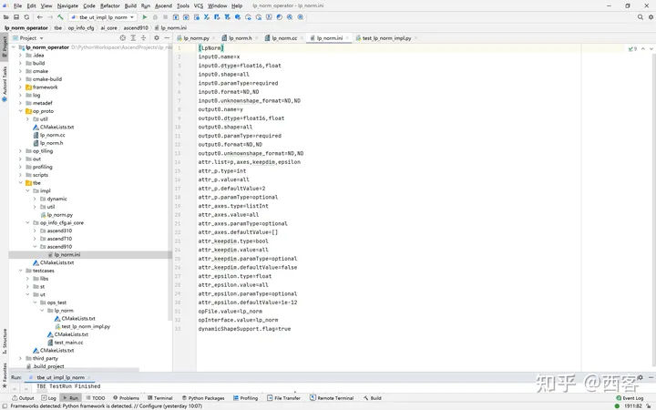

Ascend910的算子信息库文件

## 7.算子编译

算子交付件开发完成后，需要对算子工程进行编译，生成自定义算子安装包*.run，详细的编译操作包括：

- 将TBE算子信息库定义文件*.ini编译成aic-{soc version}-ops-info.json
- 将原型定义文件*.h与*.cc编译成libcust_op_proto.so。
- 将TensorFlow/Caffe/Onnx算子的适配插件实现文件*.h与*.cc编译成libcust_{tf|caffe|onnx}_parsers.so。

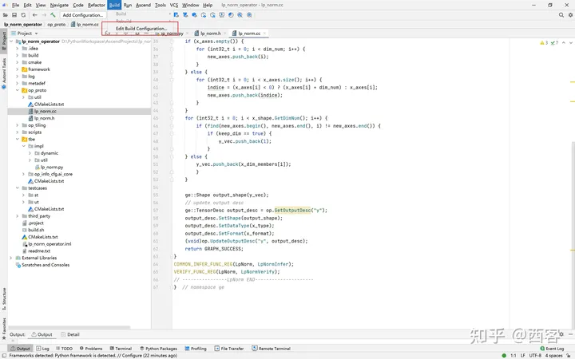

算子编译

- 选择Remote Build 进行远程部署
- 配置环境变量ASCEND_TENSOR_COMPILER_INCLUDE=/usr/local/Ascend/ascend-toolkit/latest/include
- 点击执行Build

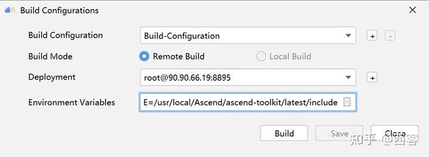

算子编译设置

| 参数                  | 说明                                                         |
| --------------------- | ------------------------------------------------------------ |
| Build Configuration   | 编译配置名称，默认为Build-Configuration                      |
| Build Mode            | 编译方式。 Remote Build：远端编译。 Local Build：本地编译。  |
| Deployment            | Remote Build模式下显示该配置。 可以将指定项目中的文件、文件夹同步到远程指定机器的指定目录。 |
| Environment variables | Remote Build模式下显示该配置。配置环境变量。                 |
| Target OS             | Local Build模式下显示该配置。 针对Ascend EP：选择昇腾AI处理器所在硬件环境的Host侧的操作系统。 针对Ascend RC：选择板端环境的操作系统。 |
| Target Architecture   | Local Build模式下显示该配置。选择Target OS的操作系统架构。   |

编译成功之后会在在cmake-build目录下生成自定义算子安装包*.run

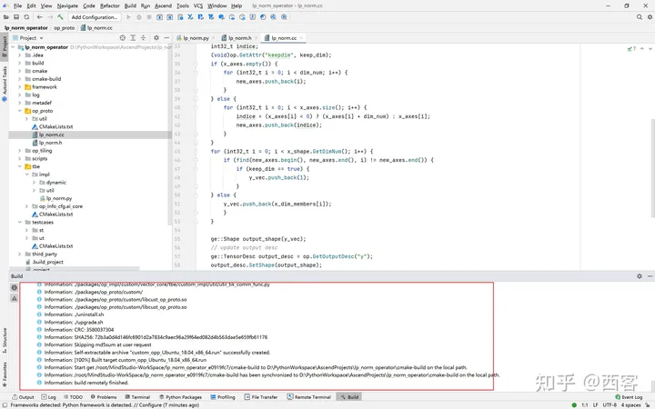

算子编译成功

## 8.算子部署

算子部署指将算子编译生成的自定义算子安装包（*.run）部署到OPP算子库中。在推理场景下，自定义算子直接部署到开发环境的OPP算子库。在训练场景下，自定义算子安装包需要部署到运行环境的OPP算子库中。

- 选择Ascend->Operator Deployment

- 选择Operator Deploy Remotely 进行远程部署

- 设置Environment Variables

- - ASCEND_OPP_PATH=/usr/local/Ascend/ascend-toolkit/latest/opp


- 点击Operator deploy进行部署

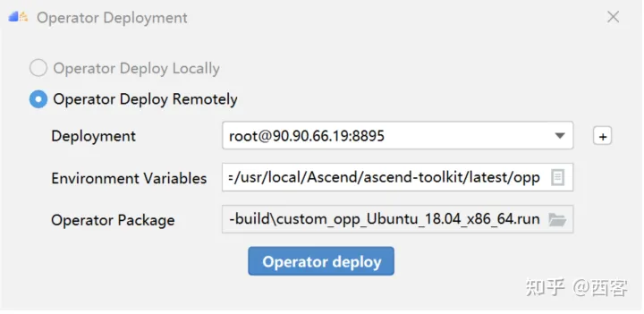

算子部署参数设置

| 参数                  | 说明                                                         |
| --------------------- | ------------------------------------------------------------ |
| Build Configuration   | 编译配置名称，默认为Build-Configuration                      |
| Deployment            | Remote Build模式下显示该配置。 可以将指定项目中的文件、文件夹同步到远程指定机器的指定目录。 |
| Environment variables | Remote Build模式下显示该配置。配置环境变量。                 |


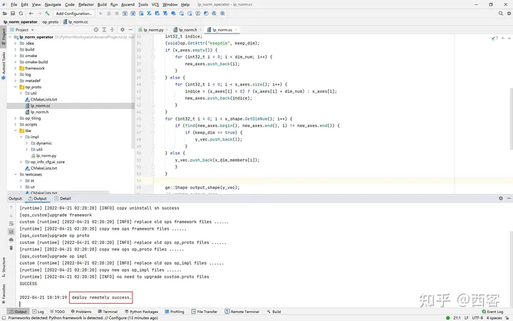

算子部署成功

## 9.算子UT测试

基于MindStudio进行算子开发的场景下，用户可基于MindStudio进行算子的UT测试，UT（Unit Test：单元测试）是开发人员进行算子代码验证的手段之一，主要目的是： *测试算子代码的正确性，验证输入输出结果与设计的一致性。* UT侧重于保证算子程序能够跑通，选取的场景组合应能覆盖算子代码的所有分支（一般来说覆盖率要达到100%），从而降低不同场景下算子代码的编译失败率。

右击UT测试脚本进入设置

更改Target为Simulator_TMModel，全选测试用例，点击ok执行


UT测试

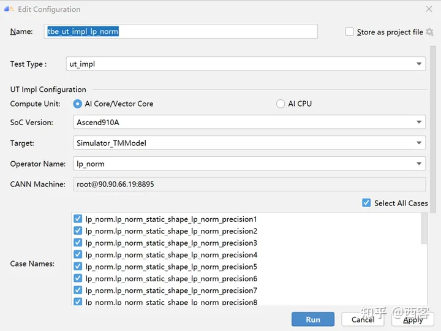

图18：UT测试参数设置


| 参数          | 说明                                                         |
| ------------- | ------------------------------------------------------------ |
| Name          | 运行配置名称，用户可以自定义。                               |
| Compute Unit  | 选择计算单元                                                 |
| SoC Version   | 下拉选择当前版本的昇腾AI处理器类型。                         |
| Target        | 运行环境。 Simulator_Function：功能仿真环境。 Simulator_TMModel：快速展示算子执行的调度流水线，不进行实际算子计算。 |
| Operator Name | 选择运行的测试用例。                                         |
| CANN Machine  | CANN工具所在设备的deployment信息。                           |
| Case Names    | 勾选需要运行的测试用例，即算子实现代码的UT Python测试用例。  |


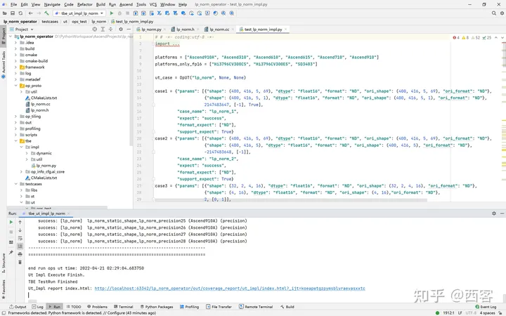

UT测试成功

显示profiling数据

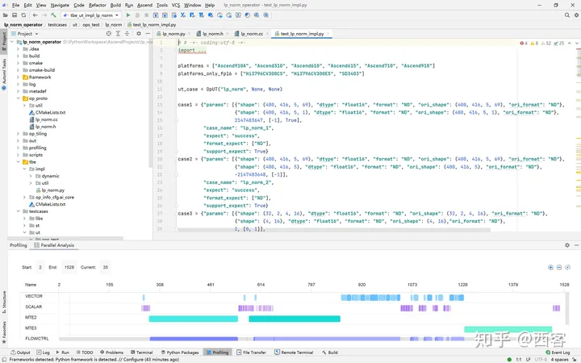

UT测试参数设置profiling数据

ut测试覆盖率


UT测试覆盖率

## 10、算子ST测试

自定义算子部署到算子库（OPP）后，可进行ST（System Test）测试，在真实的硬件环境中，验证算子功能的正确性。

ST测试的主要功能是：

- 基于算子测试用例定义文件*.json生成单算子的om文件；
- 使用AscendCL接口加载并执行单算子om文件，验证算子执行结果的正确性。
- ST测试会覆盖算子实现文件，算子原型定义与算子信息库，不会对算子适配插件进行测试。

> 如果需要进行profiling则要在linux的path中添加msprof的路径
> 即将export PATH=$PATH:/usr/local/Ascend/ascend-toolkit/latest/tools/profiler/bin/添加在~/.bashrc中

右击LpNorm_case_20210527144255.json选择run ST Case进入设置

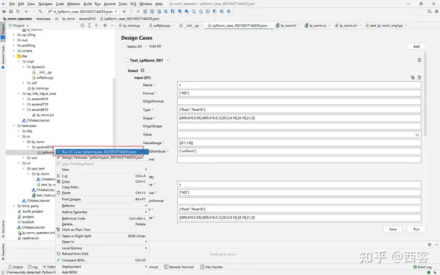

ST测试

- 设置环境变量
- 在st测试的Advanced Options中打开profiling

> st测试环境变量设置

| Name               | Value                                                        |
| ------------------ | ------------------------------------------------------------ |
| ASCEND_DRIVER_PATH | /usr/local/Ascend/driver                                     |
| ASCEND_HOME        | /usr/local/Ascend//ascend-toolkit/latest                     |
| LD_LIBRARY_PATH    | \${ASCEND_DRIVER_PATH}/lib64: \${ASCEND_HOME}/lib64:$LD_LIBRARY_PATH |


ST测试参数设置

| 参数                     | 说明                                                         |
| ------------------------ | ------------------------------------------------------------ |
| Name                     | 运行配置名称，用户可以自定义。                               |
| Test Type                | 选择st_cases 。                                              |
| Execute Mode             | Remote Execute：远程执行测试。Local Execute：本地执行测试    |
| Deployment               | 可以将指定项目中的文件、文件夹同步到远程指定机器的指定目录。 |
| CANN Machine             | CANN工具所在设备deployment信息。                             |
| Environment Variables    | 添加环境变量                                                 |
| Operator Name            | 选择需要运行的算子。                                         |
| Executable File Name     | 下拉选择需要执行的测试用例定义文件。                         |
| Target OS                | 针对Ascend EP：选择昇腾AI处理器所在硬件环境的Host侧的操作系统。 |
| Target Architecture      | 选择Target OS的操作系统架构                                  |
| Case Names               | 选择Target OS的操作系统架构。                                |
| Enable Auto Build&Deploy | 选择是否在ST运行过程中执行编译和部署。                       |
| Enable Profiling         | 使能profiling，获取算子在昇腾AI处理器上的性能数据            |

ST测试成功之后点击profiling可以查看profiling数据


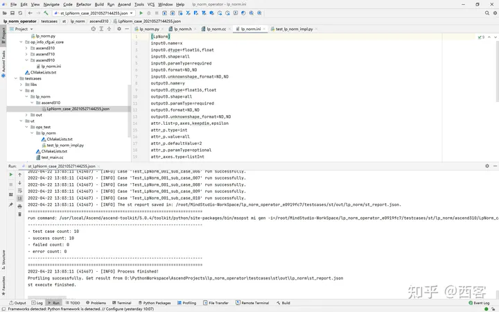

ST测试成功

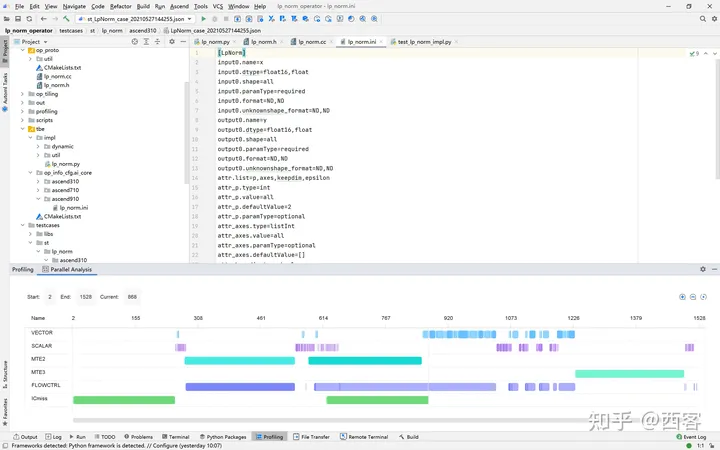

ST测试profiling


## Q&A

### 1.编译或部署遇到错误fatal error:acl/acl.h:No such file or directory

可能是CANN路径设置问题，CANN路径需要设置到版本一级如：/usr/local/Ascend/ascend-toolkit/5.0.4

点击Setting-->Appearance Behavior --> System Settings --> CANN

找到Remote CANN location

### 2.如果UT测试中，明明写了测试用例却没有显示测试用例

可能是本地环境没有安装tensorflow，需要在本地环境安装tensorflow=1.15

## 从昇腾社区中获得更多AI内容

昇腾的官网、论坛以及文档提供了很多有关AI的内容，推荐大家前去查阅

- 昇腾官网[https://www.hiascend.com/](https://link.zhihu.com/?target=https%3A//www.hiascend.com/)
- 包含昇腾相关的全工具链的介绍
- 最全，由此可以进入昇腾论坛和各个工具的介绍以及用户手册
- 昇腾论坛[https://bbs.huaweicloud.com/forum/forum-726-1.html](https://link.zhihu.com/?target=https%3A//bbs.huaweicloud.com/forum/forum-726-1.html)
- 开发者论坛，论坛内有各种技术大牛的技术干货分享，
- 也有各种问题的求助，会有技术大牛或官方的社区人员来回复、帮助解决问题
- 官方也会在论坛内发布一些开发者活动，有丰厚的奖品
- MindStudio [https://www.hiascend.com/zh/software/mindstudio](https://link.zhihu.com/?target=https%3A//www.hiascend.com/zh/software/mindstudio)
- 包含基于MindStudio开发的全部功能介绍以及用户手册