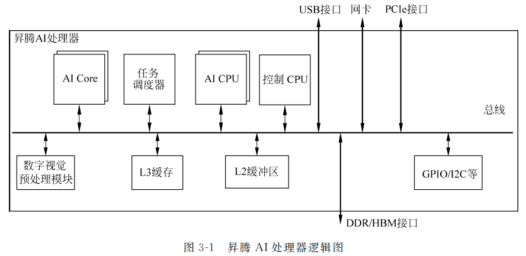
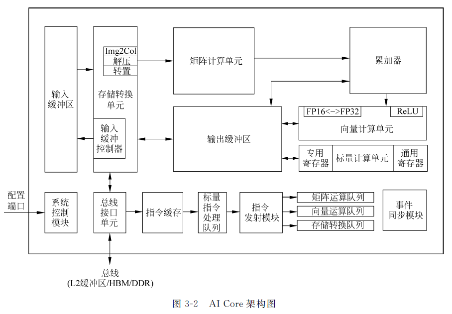

# 昇腾 AI 处理器：达芬奇架构

## 昇腾 AI 处理器

### 背景

为了满足当今飞速发展的深度神经网络对芯片算力的需求, 华为公司于 2018 年推出了昇腾系列 AI 处理器 (NPU, Neural-Network Processing Units), 可以对整型数 (INT8、INT4) 或浮点数 (FP16) 提供强大高效的乘加计算力
由于昇腾 AI 处理器具有强大的算力并且在硬件体系结构上对于深度神经网络进行了特殊的优化, 从而使之能以极高的效率完成目前主流深度神经网络的前向计算, 因此在智能终端等领域拥有广阔的应用前景

### 主要的架构组成部件

昇腾 AI 处理器本质上是一个片上系统, 主要可以应用在与图像、视频、语音、文字处理相关的场景。其主要的架构组成部件包括特制的计算单元、大容量的存储单元和相应的控制单元。

- Multi-Core (AI CPU + Control CPU): 昇腾 AI 处理器集成了多个 CPU 核心, 每个核心都有独立的 L1 和 L2 Cache, 所有核心共享一个片上 L3 Cache
  集成的 CPU 核心按照功能可以划分为专用于控制处理器整体运行的控制 CPU 和专用于承担非矩阵类复杂计算的 AI CPU。两类任务占用的 CPU 核数可由软件根据系统实际运行情况动态分配
- AI Core: 除了 CPU 之外,该处理器真正的算力担当是采用了达芬奇架构的 AI Core。这些 AI Core 通过特别设计的架构和电路实现了高通量、大算力和低功耗, 特别适合处理深度学习中神经网络必需的常用计算, 如矩阵相乘等
  - 8 MB 片上 L2 Cache: 针对深度神经网络参数量大、中间值多的特点, 该处理器还特意为 AI 计算引擎配备了片上 L2 缓冲区, 用来将大量需要复用的中间数据缓存在片上，进而提供高带宽、低延迟、高效率的数据交换和访问，同时也有助于降低系统整体功耗

- 任务调度器 (Task Scheduler, TS): 实现计算任务在 AI Core 上的高效分配和调度的专用 CPU。该 CPU 专门服务于 AI Core 和 AI CPU, 而不承担任何其他的事务和工作

- 数字视觉预处理模块 (HW) (Digital Vision Pre-Processing, DVPP): 视频和图像数据在进入昇腾 AI 处理器的计算引擎处理之前, 需要生成满足处理要求的输入格式、分辨率等, 因此需要调用数字视觉预处理模块进行预处理以实现格式和精度转换等要求 (对应于每一种不同的功能都会设计一个相应的硬件电路模块来完成计算工作)

  - 视频编解码: 视频解码 (Video Decoder,VDEC)、视频编码 (Video Encoder,VENC) (支持 4K 分辨率)

  - 图像编解码: JPEG 编解码 (JPEG Decoder/Encoder, JPEGD/E)、PNG 解码 (PNG Decoder, PNGD)

  - 图像预处理 可以完成对输入图像的上/下采样、裁剪、色调转换等多种功能

> AI 计算引擎 = AI Core + AI CPU

## 可扩展性

- DDR/HBM 接口: 处理器可以采用 LPDDR4 高速主存控制器接口, 价格较低。目前主流片上系统处理器的主存一般由 DDR (Double Data Rate,双倍速率内存) 或 HBM (High Bandwidth Memory, 高带宽存储器) 构成, 用来存放大量的数据
- PCIe 总线接口: 当该处理器作为计算服务器的加速卡使用时,会通过 PCIe 总线接口和服务器其他单元实现数据互换
  由于采用了模块化的设计,可以很方便地通过叠加模块的方法提高后续芯片的计算力。各个模块间通过基于 CHI 协议的片上环形总线相连, 实现模块间的数据连接通路并保证数据的共享和一致性
- 其他通用的外设接口模块包括 USB、磁盘、网卡、GPIO、I2C 和电源管理接口等

### 达芬奇架构 (DaVinci Architecture)

#### DSA (特定域架构)

Domain Specific Architecture, DSA (特定域架构)

达芬奇架构基于 ARM 架构，是华为自研的面向 AI 计算特征的全新计算架构

不同于传统的支持通用计算的 CPU 和 GPU, 也不同于专用于某种特定算法的专用芯片 ASIC, 达芬奇架构本质上是为了适应某个特定领域中的常见应用和算法

#### AI Core (达芬奇架构)

昇腾 AI 处理器的计算核心主要由 AI Core 构成, 负责执行标量、向量和张量相关的计算密集型算子。AI Core 采用了达芬奇架构.

- **计算部件**: 矩阵计算单元 (Cube Unit)、向量计算单元 (Vector Unit) 和标量计算单元 (Scalar Unit)
  - 这三种计算单元分别对应了张量、向量和标量三种常见的计算模式, 形成了三条独立的执行流水线, 在系统软件的统一调度下互相配合达到优化的计算效率

- **片上缓冲区**: 这些存储资源和相关联的计算资源相连,或者和总线接口单元 (Bus Interface Unit, BIU) 相连,从而可以获得外部总线上的数据；具体来说，片上缓冲区包括:

  - 用来放置整体图像特征数据、网络参数以及中间结果的输入缓冲区 (Input Buffer, IB) 和输出缓冲区(Output Buffer, OB)

  - 提供一些临时变量的高速寄存器单元, 这些寄存器单元位于各个计算单元中

- **存储转换单元** (Memory Transfer Unit, MTE): 设置于输入缓冲区之后, 主要的目的是为了以极高的效率实现数据格式的转换
  - 例如卷积操作中为了加速卷积运算，需要用 Img2Col 函数将卷积操作转化为矩阵乘积操作。存储转换单元将 Img2Col 函数固化在了硬件电路中, 极大地提升了 AI Core 的执行效率, 从而能够实现不间断的卷积计算 (与之相对的，GPU 是以软件来实现 Img2Col 函数的，因此效率不如 AI Core)

- **控制单元**: 主要包括系统控制模块、标量指令处理队列、指令发射模块、矩阵运算队列、向量运算队列、存储转换队列和事件同步模块

  - 系统控制模块负责指挥和协调 AI Core 的整体运行模式、配置参数和实现功耗控制等

  - 标量指令处理队列主要实现控制指令的译码

- 指令发射模块: 指令被译码后，就会通过指令发射模块顺次发射出去。根据指令的不同类型, 指令将会分别发送到矩阵运算队列、向量运算队列和存储转换队列 (标量指令会驻留在标量指令处理队列中进行后续执行)

  - 四条独立的流水线：矩阵运算队列、向量运算队列和存储转换队列三个队列中的指令依据 FIFO 的方式分别输出到矩阵计算单元、向量计算单元和存储转换单元进行相应的计算。最终形成了标量、向量、张量、存储转换四条独立的流水线, 可以并行执行以提高指令执行效率

  - 事件同步模块: 如果指令执行过程中出现依赖关系或者有强制的时间先后顺序要求,则可以通过事件同步模块来调整和维护指令的执行顺序
    - 事件同步模块完全由软件控制, 在软件编写的过程中可以通过插入同步符的方式来指定每一条流水线的执行时序从而达到调整指令执行顺序的目的

在 AI Core 中,存储单元为各个计算单元提供被转置过并符合要求的数据, 计算单元返回运算的结果给存储单元, 控制单元为计算单元和存储单元提供指令控制, 三者相互协调合作完成计算任务

# 参考

1. 《昇腾AI处理器架构与编程——深入理解CANN技术原理及应用》
2. [昇腾 (Ascend) AI 处理器：达芬奇架构](https://blog.csdn.net/weixin_42437114/article/details/116980129)