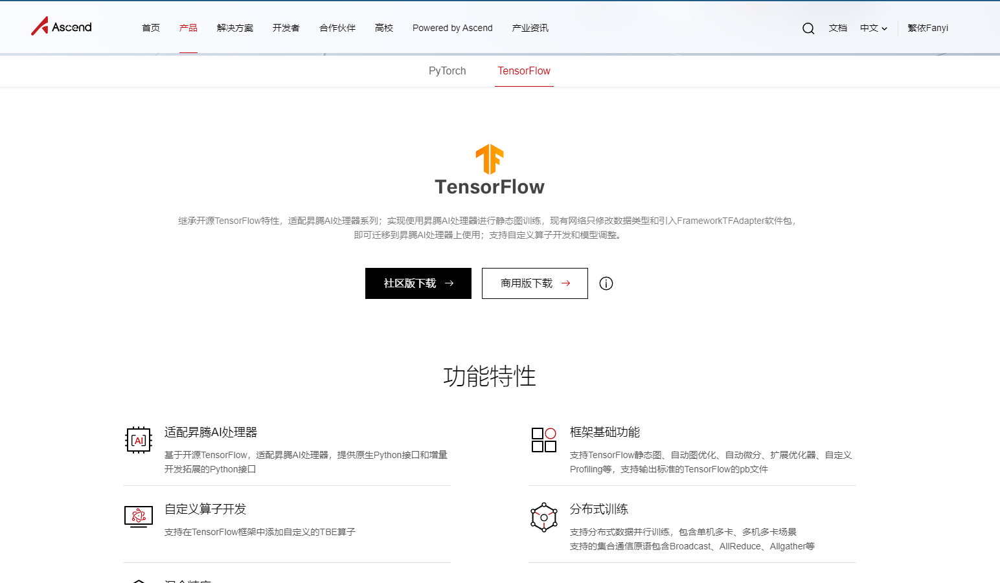
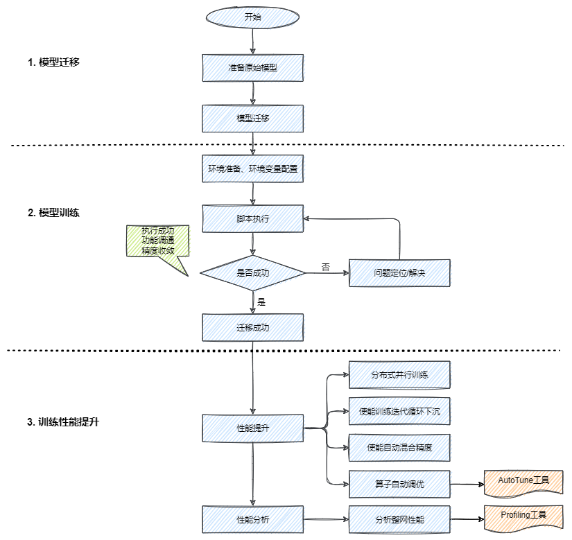

# TensorFlow 模型迁移

## 一、为什么要做模型迁移

目前人工智能领域内，AI算法模型搭建方面的技艺已经是炉火纯青，市面上用于AI模型搭建的深度学习框架，除了华为开源的昇思MindSpore，还有Google的TensorFlow、Facebook的PyTorch、Caffe等。

但是AI模型训练却是一个漫长的过程，随着模型参数量、样本的增多，训练一个模型动辄以月为单位，此时一款高性能AI处理器简直是雪中送炭。昇腾910 AI处理器是华为在2019年发布的人工智能（AI）专用的神经网络处理器，其算力高达256T，最新款算力高达310T，是业界主流处理器算力的2倍，基于昇腾910 AI处理器的昇腾系列硬件，比如Atlas 800训练服务器，算力更是大到惊人，此时你一定跃跃欲试了。

除了昇思MindSpore外，TensorFlow等其他深度学习框架下的模型并不能直接在昇腾910 AI处理器上训练，为了使其充分利用昇腾910 AI处理器的澎湃算力来提升训练性能，我们需要借助异构计算架构CANN的Plugin适配层转换，使转换后的模型能够高效运行在昇腾910 AI处理器上。值得庆幸的是，目前，CANN已经能够支持多种主流AI框架，包括昇思MindSpore、TensorFlow、PyTorch、飞浆、ONNX等，并且开发者只需要非常少的改动，即可快速搞定算法移植，大大减少切换平台的代价。

下面的课程中，我们主要以TensorFlow模型迁移和训练为例进行介绍。

## 二、了解两种模型迁移方式

将TensorFlow网络模型迁移到昇腾AI处理器执行训练，主要有两种方式：

一种是 自动迁移 方式。通过迁移工具对原始脚本进行AST语法树扫描，可自动分析原生的TensorFlow API在昇腾AI处理器上的支持度，并将原始的TensorFlow训练脚本自动迁移成昇腾AI处理器支持的脚本，对于无法自动迁移的API，可以参考工具输出的迁移报告，对训练脚本进行相应的适配修改。

一种是 手工迁移 方式。算法工程师需要人工分析TensorFlow训练脚本中的API支持度情况，并且参照文档逐一手工修改不支持的API，以便在昇腾AI处理器上训练，该种方式较为复杂，我们建议大家优先使用自动迁移方式。

## 三、TensorFlow AI 模型自动迁移详解

自动迁移是通过工具对原始脚本进行AST语法树扫描，可自动分析原生的TensorFlow API在昇腾AI处理器上的支持度，并将原始的TensorFlow训练脚本自动迁移成昇腾AI处理器支持的脚本，对于无法自动迁移的API，可以参考工具输出的迁移报告，对训练脚本进行相应的适配修改。

相关学习文档，请点击：[LINK](https://www.hiascend.com/document/detail/zh/CANNCommunityEdition/51RC2alpha005/moddevg/tfmigr/atlasmprtg_13_9016.html)

### 1. 模型自动迁移步骤

**1. 下载和安装软件**

软件网址：[第三方框架适配-昇腾社区 (hiascend.com)](https://www.hiascend.com/software/ai-frameworks)


**2. 获取使用文档**

迁移工具迁移文档：[使用迁移工具迁移-自动迁移和训练-TensorFlow网络模型迁移和训练-模型开发-5.1.RC2.alpha007-CANN社区版本-文档首页-昇腾社区 (hiascend.com)](https://www.hiascend.com/document/detail/zh/CANNCommunityEdition/51RC2alpha007/moddevg/tfmigr/atlasmprtgtool_13_0003.html)



① 迁移工具在 “tfplugin” 安装目录 `/tfplugin/latest/python/site-packages/npu_bridge/convert_tf2npu/` 目录下。

② 了解工具的使用限制

### 准备脚本和数据集

① 准备脚本和数据集

### 使用工具迁移

① 安装相关依赖

② 训练脚本扫描和自动迁移

### 训练前准备

执行单Device训练-自动迁移和训练-TensorFlow网络模型迁移和训练-模型开发-5.1.RC2.alpha007-CANN社区版本-文档首页-昇腾社区 (hiascend.com)

① 将迁移后的脚本拷贝到训练路径

② 训练前，对照文档准备运行环境、ranktable 文件，并配置必要的环境变量

### 启动训练

① 启动 shell 脚本，拉起训练进程

## 四、TensorFlow AI 模型手工迁移详解

手工迁移需要算法工程师人工分析TensorFlow训练脚本中的API支持度情况，并且参照文档逐一手工修改不支持的API，以便在昇腾AI处理器上训练，该种方式较为复杂，我们建议大家优先使用自动迁移方式。

相关学习文档：[LINK](https://www.hiascend.com/document/detail/zh/CANNCommunityEdition/51RC2alpha005/moddevg/tfmigr/atlasmprtg_13_9014.html)

在线实验：[LINK](https://www.hiascend.com/college/onlineExperiment/modelarts/000001)

更多学习课程：[LINK](https://education.huaweicloud.com/courses/course-v1:HuaweiX+CBUCNXA039+Self-paced/about)（请观看第一章内容，可不关注ModelArts训练部分的介绍，后续课程会有讲解）

### 为什么要进行网络迁移

Ascend910 是华为在2019年发布的人工智能（AI）专用的神经网络处理器（NPU），其算力高达256T，最新款算力高达320T，是业界主流芯片算力的2倍，默认配套Mindspore训练框架。当前业界大多数训练脚本基于TensorFlow的PyhonAPI开发，默认运行在CPU/GPU/TPU。为了使其能够在 Ascend910 上利用NPU的澎湃算力执行训练，提升训练性能，我们需要对训练网络脚本进行少量的迁移适配工作。当前 Ascend910 上支持TensorFlow的三种API开发的训练脚本迁移：分别是Estimator，Sess.run，Keras。

### 迁移流程



### Estimator 迁移要点

① Estimator迁移
EstimatorAPI属于TensorFlow的高阶API，在2018年发布的TensorFlow1.10版本中引入，它可极大简化机器学习的编程过程。

② 使用Estimator进行训练脚本开发的一般步骤
数据预处理，创建输入函数 input_fn；
模型构建，构建模型函数 model_fn；
运行配置，实例化 Estimator，传入 Runconfig 类对象作为运行参数；
执行训练，在 Estimator 上调用训练方法 Estimator.train()，利用指定输入对模型进行固定步数的训练。
针对 Estimator 的训练脚本迁移，我们也按照以上步骤进行，以便在异腾910处理器上训练。

③ Estimator 迁移的详细步骤
0. 导包

```
from npu_bridge.npu_init import *
```

1. 数据预处理

直接迁移，无需修改。

如果你在创建 dataset 时，使用 dataset.batch 返回动态shape，需要设置 drop_remainder 为 True，使其固定shape。

```
dataset = dataset.batch(batch_size,drop_remainder=True)
```

2. 模型构建

一般直接迁移，无需修改。

如果原始网络中使用到了 tf.device，需要删除相关代码；
如果在 model 中使用了 gelu 和 dropout 接口，推荐修改为NPU提供的高性能接口。
[1] 修改 dropout

TensorFlow原始代码：

```
layers = tf.nn.dropout()
```

迁移后的代码：

```
from npu_bridge.estimator import npu_ops

layers = npu_ops.dropout()
```


[2] 修改 gelu

[2] 修改 gelu

TensorFlow原始代码：

```
def gelu(x):  
    cdf = 0.5 * (1.0 + tf.tanh(  
        (np.sqrt(2 / np.pi)) * (x + 0.044715 * tf.pow(x,3))  
    ))  
    return x * cdf  

layers = gelu()
```


迁移后的代码：

迁移后的代码：

```
from npu_bridge.estimator.npu_unary_ops import npu_unary_ops  

layers = npu_unary_ops.gelu(x)
```


3. 运行配置

原始TensorFlow通过RunConfig配置运行参数；

这一步我们需要将 TensorFlow 的 RunConfig 迁移为 NPURunConfig。由于 NPURunConfig 类是继承 RunConfig 类，因此我们在迁移时直接更改接口即可，大多数参数可不变。

TensorFlow原始代码：

```
config = tf.estimator.RunConfig(  
    model_dir = FLAGS.model_dir,  
    save_checkpoints_steps = FLAGS.save_checkpoints_steps,  
    session_config = tf.ConfigProto(allow_soft_placement = True,log_device_placement = False)  
)
```


迁移后的代码：

```
from npu_bridge.estimator.npu.npu_config import NPURunConfig  

npu_config = NPURunConfig(  
model_dir = FLAGS.model_dir,  
    save_checkpoints_steps = FLAGS.save_checkpoints_steps,  
    session_config = tf.ConfigProto(allow_soft_placement = True,log_device_placement = False)  # 配置自动选择运行设备，不记录设备指派  
)
```

### 创建 Estimator

利用指定输入对模型进行固定步数训练。

将TensorFlow的Estimator迁移为NPUEstimator。

NPUEstimator 类是继承 Estimator 类，因此在迁移时如下示例所示直接更改接口即可，参数可保持不变。

TensorFlow原始代码：

```
mnist_classifier = tf.estimator.Estimator(
	model_fn = cnn_model_fn,
	config = config,
	model_dir = "/tmp/mnist_convnet_model"
)
```

迁移后的代码：

```
from npu_bridge.estimator.npu.npu_estimator import
NPUEstimator

mist_classifier = WPUEstinator(
	model_fn = cnn_model_fn,
	config = npu_config,
	model_dir = "/tmp/mnist_convnet_model"
)
```

5. 执行训练

利用指定输入对模型进行固定步数训练。无休修改。

```
mnist_classifier.train(
	input_fn=train_input_fn,
	steps=20000,
	hooks=[1ogging_hook]
)
```

4. Session Run 迁移要点
① Sess.run 迁移
Sess.run API 属于 TensorFlow 的低阶 API，相对于 Estimator 来讲，灵活性较高，但模型的实现较为复杂。

② 使用 Sess.run API 进行训练脚本开发的一般步骤
数据预处理；
模型搭建/计算Loss/梯度更新；
创建session并初始化资源；
执行训练
与Estimator迁移相同，我们同样按照上述步骤进行迁移，以便在异腾AI处理器上训练。

③ Sess.run 迁移的详细步骤
0. 导包

```
from npu_bridge.npu_init import *
```

1. 数据预处理

2. 模型搭建/计算Loss/梯度更新

这两步与Estimator迁移相同：直接迁移，无需修改。但同样需要注意的是：

① 如果在创建 dataset 时使用 dataset.batch 返回动态 shape，需要设置 drop_remainder 为 True 使其固定 shape。

```
dataset = dataset.batch(batch_size,drop_remainder=True)
```

② 如果在模型搭建使用了 Gelu 和 Dropout 接口，建议修改为 NPU 提供的高性能接口。

[1] 修改 dropout

TensorFlow原始代码：

```
layers = tf.nn.dropout()
```

迁移后的代码：

```
from npu_bridge.estimator import npu_ops

layers = npu_ops.dropout()
```


[2] 修改 gelu

[2] 修改 gelu

TensorFlow原始代码：

```
def gelu(x):  
    cdf = 0.5 * (1.0 + tf.tanh(  
        (np.sqrt(2 / np.pi)) * (x + 0.044715 * tf.pow(x,3))  
    ))  
    return x * cdf  

layers = gelu()
```


迁移后的代码：

迁移后的代码：

```
from npu_bridge.estimator.npu_unary_ops import npu_unary_ops  

layers = npu_unary_ops.gelu(x)
```

3. 创建session并初始化资源

这一步我们需要在创建 Session 前添加如下的配置，使得训练能够在NPU上执行：

```
from tensorflow.core.protobuf.rewriter_config_pb2 import RewriterConfig

config = tf.ConfigProto()
custom_op = config.graph_options.rewrite_options.custom_optimizers.add()
custom_op.name = "Npuoptimizer"
config.graph_options.rewrite_options.remapping = RewriterConfig.OFF #必须显式关闭remap

sess = tf.Session(config = config) #创建session
```

tf.Session 原生功能在CANN平台上全部支持。

## 参考

1. [昇腾Ascend 随记 —— TensorFlow 模型迁移](https://blog.csdn.net/qq_21484461/article/details/126215269)